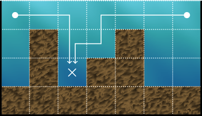
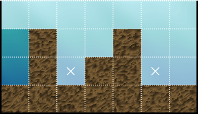
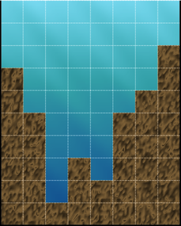
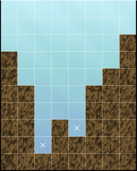

# C. Where's My Water?

**time limit per test:** 2 seconds

**memory limit per test:** 256 megabytes

**input:** standard input

**output:** standard output


 [Level 3 — David Luis Ortega, Where's My Water? ](<https://www.youtube.com/watch?v=3yV8PPnShSw>)
Let $n, h$ be positive integers. Swampy the Alligator needs water for his bathtub, and you are tasked with getting it to him. Above his house, there is an $h \times n$ grid of dirt and water tiles with $n$ columns numbered $1, \ldots, n$. In column $i$, the bottom $a_i$ tiles are dirt, and the rest on top are water tiles.

To get water to Swampy, you can place a drain on any tile that isn't a dirt tile. Placing a drain takes away all water tiles that can access the drain by moving only down, left, or right on the grid without crossing any dirt tiles.

For example, placing the drain on the $\times$ in the grid below will drain both the top left and top right water tiles and result in $10$ tiles being drained:





What is the maximum amount of water you can get to Swampy after placing at most two drains? Note that water tiles that could have been taken by either drain are only counted once.

#### Input

Each test contains multiple test cases. The first line contains the number of test cases $t$ ($1 \le t \le 10^3$). The description of the test cases follows.

The first line contains two integers $n$ and $h$ ($1 \leq n \leq 2000, 1 \leq h \leq 10^9$) — the number of columns and height of the grid.

The next line contains $n$ integers $a_i$ ($1 \leq a_i \leq h$) — the elevation of the dirt in column $i$.

It is guaranteed that the sum of $n$ over all test cases does not exceed $2000$.

#### Output

For each test case, output a single integer — the maximum number of water tiles that can be obtained with at most two drains.

#### Example

#### Input
```
6
7 4
1 3 1 2 3 1 1
8 10
7 5 1 3 2 5 6 8
1 1
1
10 20
5 2 1 2 1 3 6 7 1 1
5 1000000000
1 420420420 1 420420420 1
1 1000000000
1
```

#### Output
```
14
43
0
170
3738738738
999999999
```

#### Note

In the first test case, the grid is the example shown in the statement. It is possible to drain $14$ tiles of water by placing the drains as shown:





In the second test case, the grid is shown below:





It is possible to drain all $43$ tiles of water by placing the drains as shown:





In the third test case, the grid is a single dirt tile, and no drains may be placed. So, the answer is $0$.
