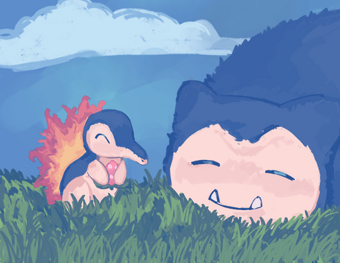
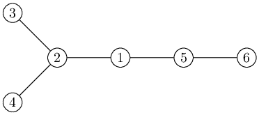
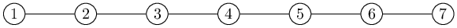

# D. Boxed Like a Fish

**time limit per test:** 2 seconds

**memory limit per test:** 256 megabytes

**input:** standard input

**output:** standard output


 [Elite Four Battle Theme — Junichi Masuda, Pokémon Black & White ](<https://www.youtube.com/watch?v=llnXhrCn9Yo>)




Let $n, k$ be positive integers. You are given a tree$^{\text{∗}}$ with $n$ vertices numbered $1, \ldots, n$.

Cyndaquil is traversing this tree and is trying to reach one of its leaves$^{\text{†}}$. Initially, he starts at a non-leaf vertex $v$, and in one turn, he may either choose to stay still or move from a vertex $v$ along an edge to any of its neighbors $u$.

However, Snorlax is trying to stop Cyndaquil from doing this by sleeping on an edge. When he picks an edge, Cyndaquil is blocked from traversing it until Snorlax moves again. Furthermore, only one edge may be disallowed at a time, so that only the most recently chosen edge is blocked.

Of course, Snorlax is slow and needs some time before he can pick a new edge. He has a cooldown timer, initially at $0$. He may only choose a new edge when the cooldown is at $0$ or lower, but he doesn't have to do it immediately. When he moves to a new edge, the timer is reset to $k$. After each of Cyndaquil's turns (even if he stays still), the cooldown timer decreases by $1$.

They take turns acting as previously described, with Snorlax starting first, and initially, he is not sleeping on any edge. Assuming both of them play optimally, can Cyndaquil always reach a leaf after a finite number of turns?

$^{\text{∗}}$A tree is a connected graph without cycles.

$^{\text{†}}$A vertex with degree 1 is called a leaf.

#### Input

Each test contains multiple test cases. The first line contains the number of test cases $t$ ($1 \le t \le 10^4$). The description of the test cases follows.

The first line of each test case contains three integers $n$, $k$, and $v$ ($3 \leq n \leq 5 \cdot 10^5$, $1 \leq k, v \leq n$) — the number of vertices in the tree, Snorlax's cooldown timer, and Cyndaquil's starting vertex.

The next $n-1$ lines of each test case contain two integers $a$ and $b$ ($1 \leq a, b \leq n$, $a \neq b$), describing an edge between vertices $a$ and $b$. It is guaranteed that these edges form a tree and that $v$ is not a leaf.

It is guaranteed that the sum of $n$ over all test cases does not exceed $5 \cdot 10^5$.

#### Output

For each test case, print a single line containing either "YES" or "NO", representing whether or not Cyndaquil can always reach a leaf in a finite number of turns.

You can output the answer in any case (upper or lower). For example, the strings "yEs", "yes", "Yes", and "YES" will be recognized as positive responses.

#### Example

#### Input
```
6
6 2 1
1 2
2 3
2 4
1 5
5 6
7 1 4
1 2
2 3
3 4
4 5
5 6
6 7
3 1 3
1 3
2 3
4 1 4
1 3
3 4
4 2
9 3 5
4 5
5 6
4 7
9 8
8 7
1 2
2 3
3 4
9 4 5
4 5
5 6
4 7
9 8
8 7
1 2
2 3
3 4
```

#### Output
```
YES
NO
YES
NO
NO
YES
```

#### Note

In the first test case, the tree is shown below:





Cyndaquil starts at vertex $1$. If Snorlax blocks the edge from $1$ to $2$, then Cyndaquil can reach vertex $6$ after two turns, which is a leaf. Otherwise, Cyndaquil can advance to vertex $2$, from which Snorlax cannot stop him from reaching at least one of vertices $3$ and $4$.

In the second test case, the tree is shown below:





It can be shown that Snorlax can block Cyndaquil indefinitely from reaching either leaf $1$ or $7$.
