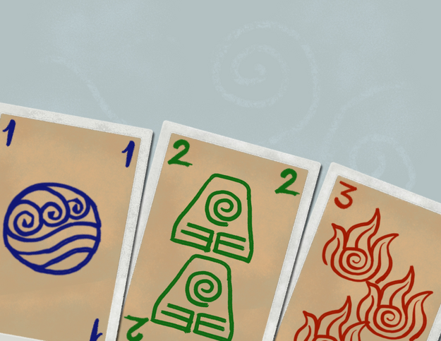

# F. Hanabi

**time limit per test:** 3 seconds

**memory limit per test:** 512 megabytes

**input:** standard input

**output:** standard output


 [Last Agni Kai — Jeremy Zuckerman, Avatar: The Last Airbender ](<https://www.youtube.com/watch?v=k_P6Xjx9Tnk>)




Let $n, m$ be positive integers. Iroh and Zuko are playing a variant of [Hanabi](<https://en.wikipedia.org/wiki/Hanabi_(card_game)>), a collaborative card game, with $n$ ranks ($1, \ldots, n$) and $m$ colors ($1, \ldots, m$). In particular, Zuko holds a hand of $n \cdot m$ cards, containing one card with each possible pairing of rank and color. On his turn, he can choose any one of the cards and play it onto the board. However, if he tries to play a card of rank $r \geq 2$ and color $c$ when the card of rank $r-1$ and color $c$ was not already played, they will lose.

To make this task much more interesting, Zuko will hold all of his cards facing towards Iroh, so that only Iroh is able to see their ranks and colors. To give Zuko information, on his turn, Iroh can give him the following types of clues:

- A rank clue for rank $r$ will highlight the positions of all remaining cards in his hand with rank $r$.
- A color clue for color $c$ will highlight the positions of all remaining cards in his hand with color $c$.

A clue may only be given if it highlights at least one card. Also, before giving a new clue, all cards are reset to an unhighlighted state.

The game begins with Iroh giving a clue, then Zuko playing a card, and they alternate until either all cards are played on the board, or some card is played in an invalid order.

Zuko has decided that on his turn, he will always play the leftmost highlighted card in his hand. Iroh would like to make a series of clues that both make Zuko play the cards in a valid order, but also minimizes the number of turns on which his clue changed from the previous turn.

Compute the minimum number of times Iroh's clue could change between turns.

#### Input

Each test contains multiple test cases. The first line contains the number of test cases $t$ ($1 \le t \le 10^4$). The description of the test cases follows.

The first line of each test case contains two integers $n$ and $m$ ($1 \leq n, m \leq 2 \cdot 10^5, 1 \leq n \cdot m \leq 2 \cdot 10^5$) — the number of ranks and colors, respectively.

The second line of each test case contains $n \cdot m$ integers $r_1, r_2, \ldots, r_{n \cdot m}$ ($1 \leq r_i \leq n$), the ranks of the cards in Zuko's hand from left to right.

The third line of each test case contains $n \cdot m$ integers $c_1, c_2, \ldots, c_{n \cdot m}$ ($1 \leq c_i \leq m$), the colors of the cards in Zuko's hand from left to right.

It is guaranteed that each of the cards $(r, c)$ for $1 \leq r \leq n$, $1 \leq c \leq m$ appears once in the given hand $(r_1, c_1), (r_2, c_2), \ldots, (r_{n \cdot m}, c_{n \cdot m})$.

It is guaranteed that the sum of $n \cdot m$ over all test cases does not exceed $2 \cdot 10^5$.

#### Output

For each test case, print a single integer — the minimum number of times Iroh's clue could change between turns. It can be shown that it is always possible to play all cards in a valid order.

#### Example

#### Input
```
7
3 2
1 2 3 1 2 3
1 1 1 2 2 2
2 2
2 1 2 1
1 2 2 1
1 7
1 1 1 1 1 1 1
7 6 5 4 3 2 1
5 1
1 4 2 3 5
1 1 1 1 1
8 3
1 1 1 3 2 2 5 3 3 6 4 4 7 5 5 8 6 6 2 7 7 4 8 8
1 2 3 1 2 3 1 2 3 1 2 3 1 2 3 1 2 3 1 2 3 1 2 3
9 4
2 1 1 2 3 2 3 5 3 6 5 6 7 7 8 5 9 9 4 4 8 1 2 3 6 7 8 4 5 6 9 1 4 7 9 8
4 2 1 2 2 1 4 2 1 2 1 1 1 2 2 4 1 2 2 1 1 3 3 3 4 4 4 3 3 3 4 4 4 3 3 3
6 2
2 1 3 2 4 3 5 4 6 6 1 5
1 2 1 2 1 2 1 2 1 2 1 2
```

#### Output
```
1
1
0
3
6
8
4
```

#### Note

In the first test case, the optimal sequence of moves is as follows:

- Iroh gives a color clue for color $1$.
- For the next three turns, Zuko plays the rank $1, 2$ and $3$ cards of color $1$, in that order.
- Iroh gives a color clue for color $2$.
- For the next three turns, Zuko plays the rank $1, 2$ and $3$ cards of color $2$, in that order.
 Iroh changes his clue $1$ time, which can be shown to be minimal.
In the second test case, the optimal sequence of moves is as follows:

- Iroh gives a rank clue for rank $1$.
- For the next two turns, Zuko plays the rank $1$ cards of colors $2$ and $1$, in that order.
- Iroh gives a rank clue for rank $2$.
- For the next two turns, Zuko plays the rank $2$ cards of colors $1$ and $2$, in that order.
 Iroh changes his clue $1$ time, which can be shown to be minimal.
In the third test case, the optimal sequence of moves is as follows:

- Iroh gives a rank clue for rank $1$.
- For the next seven turns, Zuko plays the rank $1$ cards of colors $7, 6, 5, 4, 3, 2, 1$, in that order.
 Iroh changes his clue $0$ times.
In the fourth test case, the optimal sequence of moves is as follows:

- Iroh gives a rank clue for rank $1$.
- Zuko plays the rank $1$ card of color $1$.
- Iroh gives a rank clue for rank $2$.
- Zuko plays the rank $2$ card of color $1$.
- Iroh gives a rank clue for rank $3$.
- Zuko plays the rank $3$ card of color $1$.
- Iroh gives a color clue for color $1$.
- Zuko plays the rank $4$ and rank $5$ cards of color $1$, in that order.
 Iroh changes his clue $3$ times, which can be shown to be minimal.
