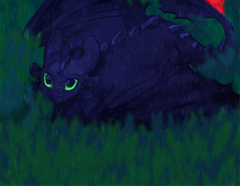
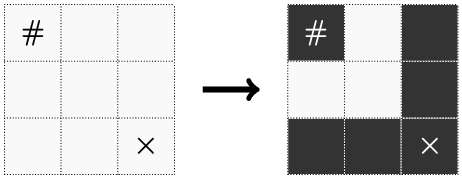
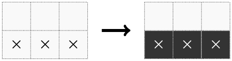
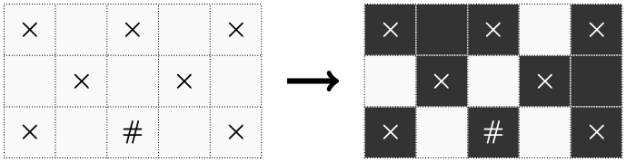

# G. Toothless

**time limit per test:** 2 seconds

**memory limit per test:** 256 megabytes

**input:** standard input

**output:** standard output


 [Forbidden Friendship — John Powell, How To Train Your Dragon ](<https://www.youtube.com/watch?v=96NgGuKQcmo>)




Let $n, m, a, b$ be positive integers with $a \leq b$. Toothless is drawing in an $n \times m$ grid of sand that is initially all white. In one move, he may do the following:

- Select any currently white cell and color it black if it has at most one black cell among its edge-adjacent neighbors.

Because he is particular about his art, Toothless thinks some cells in the grid are needy, and these cells must end up black. Of the cells that aren't needy, he also thinks some of them are special. A cell has value $b$ if it is special, and $a$ otherwise. No special cell borders a needy cell by an edge.

Let $P$ be the sum of the values of all the cells in the grid that aren't needy. Because Toothless is very particular about his art, he wants to make some number of moves such that:

- Each of the needy cells becomes black after all moves are done,
- The total value of cells that are colored black (including needy cells) is at least $\frac{2}{3} \cdot P$.

Compute any sequence of moves that Toothless could make. Tests are generated in a such way, that it is guaranteed that all of the needy cells in the input can be shaded black after some number of moves. Furthermore, it can be shown that for the given constraints, a satisfying sequence of moves always exists.

#### Input

Each test contains multiple test cases. The first line contains the number of test cases $t$ ($1 \le t \le 10^4$). The description of the test cases follows.

The first line of each test case contains four integers $n$, $m$, $a$, and $b$ ($1 \leq n, m \leq 2 \cdot 10^3, 1 \leq n \cdot m \leq 2 \cdot 10^3, 1 \leq a \leq b \leq 5 \cdot 10^5$) — the dimensions of the grid and the values of non-special and special cells, respectively.

The $i$-th of the next $n$ lines each contain a string $s_i$ — a string of exactly $m$ characters depicting the $i$-th row of cells.

- The $j$-th character is '#' if the cell at $(i, j)$ is needy.
- The $j$-th character is 'x' if the cell at $(i, j)$ is special.
- Otherwise, the $j$-th character is '.'.
 It is guaranteed that no needy cell is adjacent to a special cell.
Tests are generated in a such way, that it is guaranteed that all of the needy cells in the input can be shaded black after some number of moves.

It is guaranteed that the sum of $(nm)^2$ over all test cases does not exceed $4 \cdot 10^6$.

#### Output

For each test case, print the following.

In the first line, print the number of moves $op$ ($0 \leq op \leq n \cdot m$) you want to make.

For each of the $op$ moves, print a line containing two integers $i, j$ ($1 \leq i \leq n, 1 \leq j \leq m$), indicating that you wish to color the cell at $(i, j)$ black.

#### Example

#### Input
```
3
3 3 1 5
#..
...
..x
2 3 1 2
...
xxx
3 5 8 9
x.x.x
.x.x.
x.#.x
```

#### Output
```
6
1 1
3 1
3 2
3 3
2 3
1 3
3
2 1
2 2
2 3
10
1 1
1 2
1 3
2 2
2 5
1 5
3 5
2 4
3 3
3 1
```

#### Note

In the first test case, there is a needy cell in the top left corner and a special cell in the bottom right corner. Using the operations in the example output, we will end up with the following grid:





Of the cells that aren't needy, there are $7$ non-special cells worth $1$ each and $1$ special cell worth $5$, so $P = 12$. So, we need to shade cells with a total value of at least $\frac{2}{3} \cdot 12 = 8$; the given sequence of moves achieves a value of $10$.

In the second test case, there are no needy cells, but there are three special cells in the bottom row of cells. Using the operations in the example output, we will end up with the following grid:





There are $3$ non-special cells worth $1$ each and $3$ special cells worth $2$, so $P = 9$. So, we need to shade cells with a total value of at least $\frac{2}{3} \cdot 9 = 6$; the given sequence of moves achieves a value of $6$.

In the third test case, there is one needy cell at $(3, 3)$, and $7$ special cells. Using the operations in the example output, we will end up with the following grid:





Of the cells that aren't needy, there are $7$ non-special cells worth $8$ each and $7$ special cells worth $9$, so $P = 7 \cdot 8 + 7 \cdot 9 = 119$. So, we need to shade cells with a total value of at least $\frac{2}{3} \cdot 119 = 79 \frac{1}{3}$; the given sequence of moves achieves a value of $87$.
