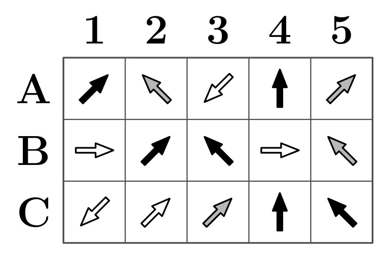

# A. Odd One Out

**time limit per test:** 1 second

**memory limit per test:** 256 megabytes

**input:** standard input

**output:** standard output

#### Output

Output exactly two characters: a single letter followed by a single digit, with no spaces or additional characters between them.
