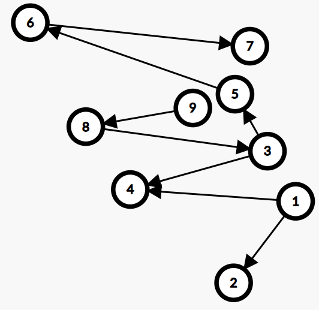
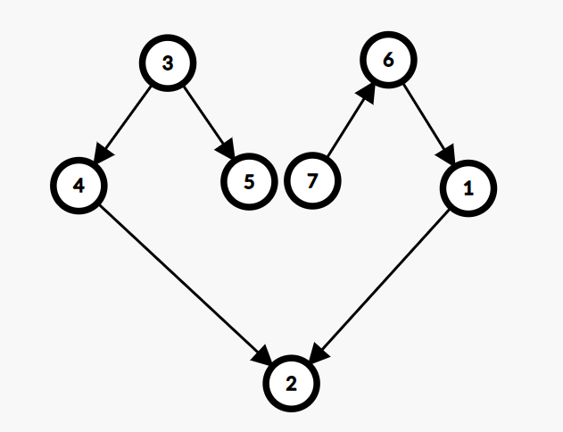

# C. Oriented Journey

**time limit per test:** 3 seconds

**memory limit per test:** 256 megabytes

**input:** standard input

**output:** standard output

This is a run-twice (communication) interactive problem.

There are two players: Player A (Neri) and Player B (Mashiro). The jury will first interact with Player A. After Player A ends their interaction, the jury will interact with Player B. Note that Player A and Player B may not directly pass information to each other; both players are only able to send information to or receive information from the jury, but they may agree on the strategy they will use to communicate.

Before the interaction, the jury determines an undirected tree $T$ of size $n$ and an integer $s$ ($1\le s\le 2^{n-1}$). These values are consistent across both players.

Player A (Neri) first receives the two integers $n$ and $s$ from the jury without acquiring extra information about the tree $T$. Then, the jury will interact with Neri for exactly $n-1$ rounds. In each round of interaction:

- The jury will reveal an undirected edge of $T$ to Neri, and then Neri needs to assign a direction to it immediately.

Note that all $n-1$ edges of $T$ are directed after this interaction, forming a new directed tree $T'$.

Player B (Mashiro) receives the directed tree $T'$ created in the interaction between Neri and the jury. Her task is to determine the value of $s$ according to the information she receives.

Neri wants to ensure that Mashiro can determine the integer $s$. Your task is to act as both players and determine an optimal interaction strategy for both players so that Mashiro can determine the integer $s$ correctly.

First Run

Your code will be run exactly two times on each test. On the first run, you will be Player A (Neri).

Input

The first line of the input contains two integers $t$ and $q$ ($1 \le t \le 10^4$, $q=1$) — the number of test cases and the run number. Here, the purpose of giving $q=1$ is so your program recognizes that this is its first run, and it should act as Player A (Neri).

For each test case, you should first read two integers $n$ and $s$ ($3\le n \le 30$, $1\le s \le 2^{n-1}$) — the size of $T$ and the integer to deliver.

Interaction

For each test case, recall that you will first receive $n$ and $s$ in the input from the jury according to the input format above. Then, you need to interact with the jury exactly $n-1$ times:

- First, read two integers $u$ and $v$ ($1\le u \lt v\le n$) from the jury, denoting that there is an undirected edge $(u,v)$ in $T$;
- Then, print two integers $a$ and $b$ on a new line to the jury, separated by a space, where $(a,b)$ is either $(u,v)$ or $(v,u)$. Printing $(a,b)=(u,v)$ means you assign the direction $u\rightarrow v$, and printing $(a,b)=(v,u)$ means you assign the direction $v\rightarrow u$.

Note that you must assign the direction for the current undirected edge before acquiring the information of the next one.

After that, you will either proceed to the next test case, or your program must terminate if you have processed every test case.

The interactor is not adaptive, which means that the tree $T$ in each test case is fixed before any interaction.

After each round of interaction do not forget to output the end of line and flush$^{\text{∗}}$ the output. Otherwise, you will get Idleness limit exceeded verdict.

If, at any interaction step, you read $-1$ instead of valid data, your solution must exit immediately. This means that your solution will receive Wrong answer because of an invalid interaction or any other mistake. Failing to exit can result in an arbitrary verdict because your solution will continue to read from a closed stream.

Second Run

On the second run, you are Player B (Mashiro).

Input

The first line of the input contains two integers $t$ and $q$ ($1\le t\le 10^4$, $q=2$) — the number of test cases and the run number. Here, the purpose of giving $q=2$ is so your program recognizes that this is its second run, and it should act as Player B (Mashiro).

The first line of each test case contains a single integer $n$ ($3\le n \le 30$) — the size of $T'$.

Then $n-1$ lines follow, each containing two integers $u$ and $v$ ($1\le u,v\le n$), denoting that there is a directed edge $u\rightarrow v$ in $T'$.

Note that the test cases in the second run may be shuffled. Please see the example test case for further illustration.

Output

For each test case, output a single integer $s$ — the integer you determined from $T'$.

After this, do not forget to output the end of line and flush the output. Otherwise, you will get Idleness limit exceeded verdict. Then, proceed to the next test case, or terminate your program if it is the last test case.

Hacks

Hacks are not allowed in this problem.

$^{\text{∗}}$To flush, use:

- fflush(stdout) or cout.flush() in C++;
- sys.stdout.flush() in Python;
- see the documentation for other languages.

#### Examples

#### Input
```
2 1
7 21
1 6
3 5
2 4
3 4
1 2
6 7
9 59
1 2
1 4
3 4
3 5
3 8
5 6
6 7
8 9
```

#### Output
```
6 1
3 5
4 2
3 4
1 2
7 6

1 2
1 4
3 4
3 5
8 3
5 6
6 7
9 8
```

#### Input
```
2 2
9
8 3
9 8
1 4
3 4
1 2
5 6
6 7
3 5
7
3 4
1 2
7 6
6 1
3 5
4 2
```

#### Output
```
59
21
```

#### Note

For the first run: The integers $s$ delivered to Neri are $s=21$ and $s=59$, respectively. Then, according to some strategy agreed upon by the players, Neri directed the trees.

For the second run: Note that the test cases are re-ordered between runs. Here are the illustrations of $T'$ for both test cases in the order of the second run:




 Illustration for the first test case



 Illustration for the second test case
Testing tool

You are provided with a command-line tool for local testing. You can download it from the materials.

To use the tool, you need to have Python installed. Run the command below in the terminal:

- On Windows: python treedir_testing_tool.py [–quiet]
- On Linux: python3 treedir_testing_tool.py [–quiet]

Arguments explanation:

- -q, –quiet is an optional argument. The tool will print the interaction logs between itself and your program, and enabling this will make the tool stop printing them.
- data_file is the input file you provide to the tool. It should follow the format below:

 - The first line contains two integers $t$ and $\text{seed}$, the number of test cases and the seed for shuffling the order of test cases/edges. Assigning $\text{seed}=0$ will make the tool keep the order without shuffling.
 - For each test case, the first line contains two integers $n$ and $s$. For the next $n-1$ lines, each line contains two integers $u$ and $v$, representing an edge in $T$.

- program is the name of your compiled program.
- arguments are the arguments your program needs.

The top line comments contain detailed information about the tool itself.

Note that:

- This tool is not exactly the same as the interactor of the problem. Judge verdicts may differ.
- This tool will check whether your input file follows the format, but it will not check whether your input satisfies the constraints.
- This tool will not check if your program fits within the time/memory limit.
