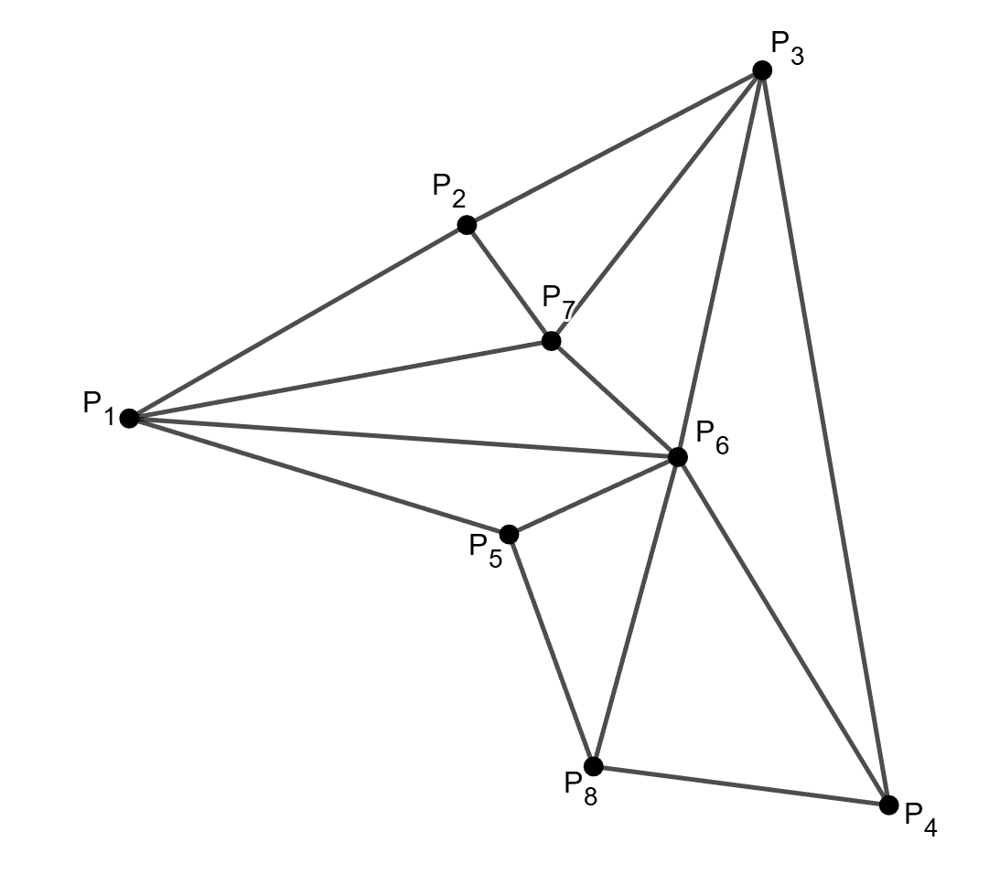
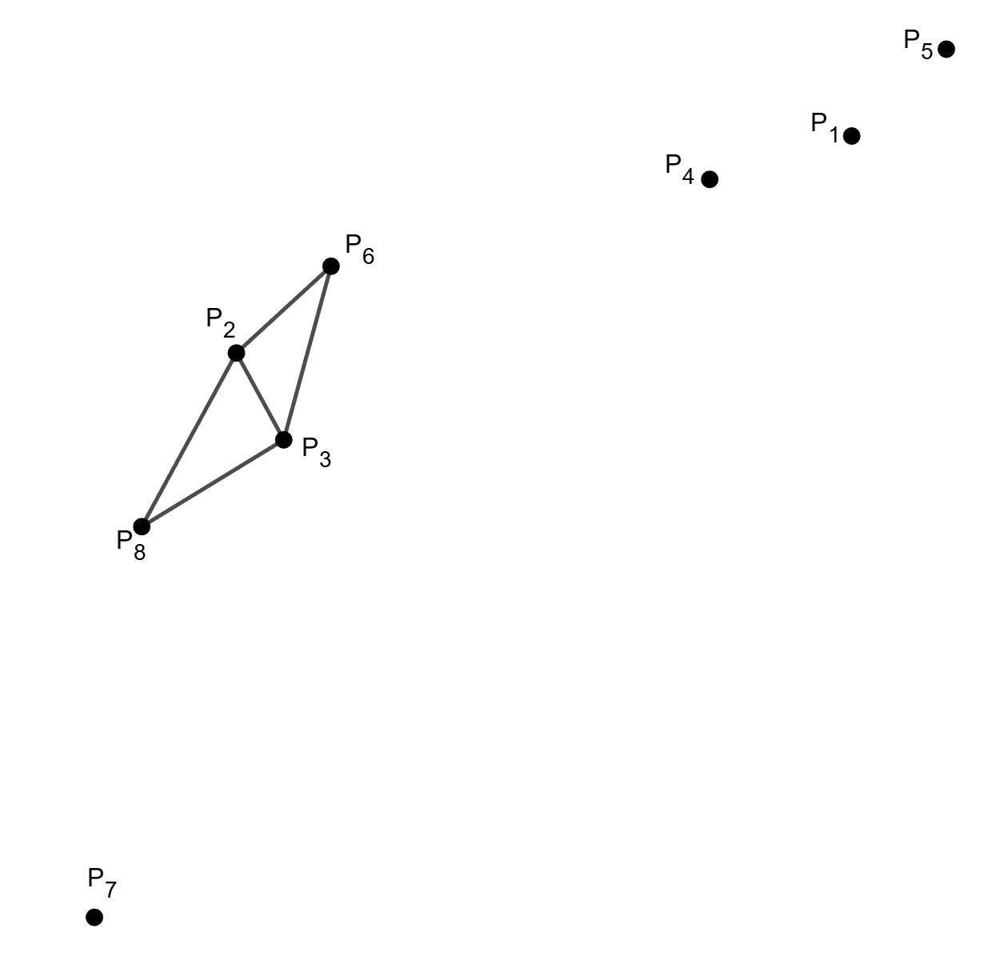

# E. Star Map

**time limit per test:** 2 seconds

**memory limit per test:** 256 megabytes

**input:** standard input

**output:** standard output


Funni-chan loves watching stars.

There are $n$ stars in the sky, which can be regarded as points on a plane with Cartesian coordinates. The coordinates of the $i$-th star are $(x_i, y_i)$. It is guaranteed that all $x_1, x_2, \ldots, x_n$ are pairwise distinct, and all $y_1, y_2, \ldots, y_n$ are pairwise distinct. The stars are numbered from $1$ to $n$ in the order they are given in the input.

Funni-chan wants to connect some pairs of these stars to form a constellation.

She defines the basic unit of a constellation as a triangle formed by three stars connected pairwise. A triangle is called harmonious if there exists an axis-aligned rectangle such that all three vertices of the triangle lie on the boundary of the rectangle.

Funni-chan imposes the following constraints on the constellation:

- Every triangle in the constellation must be harmonious.
- The interiors of any two triangles in the constellation must be disjoint. Note that the boundary of a triangle is not considered part of its interior.

Under these constraints, Funni-chan wants her constellation to contain the maximum possible number of triangles. Your task is to find this maximum number and construct a valid constellation that achieves it.

#### Input

Each test contains multiple test cases. The first line contains the number of test cases $t$ ($1 \le t \le 2\cdot 10^4$). The description of the test cases follows.

The first line of each test case contains a single integer $n$ ($3 \le n \le 2 \cdot 10^5$) — the number of stars.

Each of the next $n$ lines contains two integers $x_i$ and $y_i$ ($-10^9\le x_i, y_i \le 10^9$) — the coordinates of the $i$-th star. It is guaranteed that all $x_i$-s are pairwise distinct, and all $y_i$-s are pairwise distinct.

It is guaranteed that the sum of $n$ over all test cases does not exceed $2\cdot 10^5$.

#### Output

In the first line of each test case, you should print a single integer $m$ ($0\le m\le 2\cdot n$) — the maximum possible number of triangles in the constellation.

Then $m$ lines follow, each line containing three distinct positive integers $a_i$, $b_i$, and $c_i$ ($1 \le a_i, b_i, c_i \le n$), denoting the indices of the three stars forming the $i$-th triangle.

#### Example

#### Input
```
2
8
-10 1
-2 6
5 10
8 -9
-1 -2
3 0
0 3
1 -8
8
8 8
-5 3
-4 1
5 7
10 10
-3 5
-8 -10
-7 -1
```

#### Output
```
8
6 5 8
6 8 4
1 6 5
7 1 6
2 7 1
3 2 7
3 7 6
3 6 4
2
2 3 8
6 2 3
```

#### Note

The first test case of the example is illustrated below：





The second test case of the example is illustrated below:



