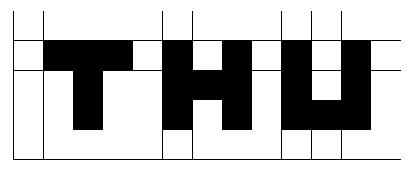
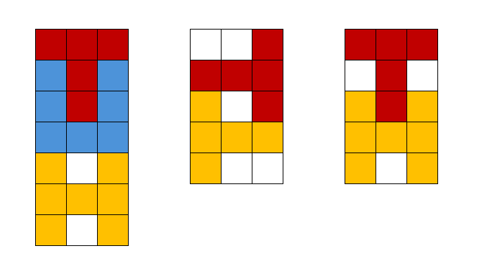

# B. THU Packing Puzzle

**time limit per test:** 1 second

**memory limit per test:** 256 megabytes

**input:** standard input

**output:** standard output

There are three types of 2D blocks: T-shaped, H-shaped, and U-shaped. Their exact shapes are shown in the figure below:



You are given three non-negative integers $c_T$, $c_H$, and $c_U$, representing the numbers of T-shaped, H-shaped, and U-shaped blocks, respectively. Your task is to pack all $(c_T + c_H + c_U)$ blocks into an $n \times 3$ grid, following these rules:

- Every block must be placed entirely inside the grid;
- No two blocks may overlap (i.e., no unit cell can be covered by more than one block);
- Blocks can be rotated by any multiple of $90^{\circ}$, but their edges must remain parallel to the grid borders.

You have to find the minimum possible value of $n$ for which such a packing exists.

#### Input

Each test contains multiple test cases. The first line contains the number of test cases $t$ ($1 \le t \le 10^4$). The description of the test cases follows.

The only line of each test case contains three integers $c_T$, $c_H$, and $c_U$ ($0\le c_T,c_H,c_U\le 10^9$, $c_T+c_H+c_U \gt 0$) — the numbers of T-shaped, H-shaped, and U-shaped blocks, respectively.

#### Output

For each test case, output a single integer — the minimum possible value of $n$.

#### Example

#### Input
```
5
1 1 1
2 0 0
1 1 0
0 0 1000000000
1000000000 1000000000 1000000000
```

#### Output
```
7
5
5
3000000000
7000000000
```

#### Note

The optimal solutions for the first three test cases are listed below:


