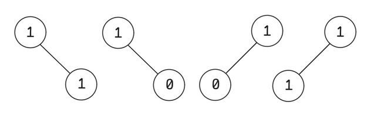

# G. Down the Pivot

**time limit per test:** 2 seconds

**memory limit per test:** 256 megabytes

**input:** standard input

**output:** standard output


Consider binary trees where each node has at most two children, and each node is labeled with either $0$ or $1$.

In one operation, you can flip all the labels on any simple path that passes through the root. Flipping a label means changing $0$ to $1$ and $1$ to $0$. Note that a path of length $1$ containing only the root is also allowed.

The cost of such a binary tree is defined as the minimum number of operations required to make all labels in the tree equal to $0$.

Given two integers $n$ and $k$, count the number of distinct labeled binary trees with exactly $n$ nodes and cost exactly $k$. Since the answer can be very large, output it modulo $10^9 + 7$.

Two binary trees are considered distinct if they have different structures, or if they have the same structure but differ in at least one node's label.

#### Input

Each test contains multiple test cases. The first line contains the number of test cases $t$ ($1 \le t \le 10^4$). The description of the test cases follows.

The only line of each test case contains two integers $n$ and $k$ ($1 \le n \le 10^6$, $0 \le k \le n$).

It is guaranteed that the sum of $n$ over all test cases does not exceed $10^6$.

#### Output

For each test case, output a single integer on a new line — the number of labeled binary trees with $n$ nodes and cost $k$, modulo $10^9+7$.

#### Example

#### Input
```
6
2 0
2 1
1 1
7 6
69 67
314159 42
```

#### Output
```
2
4
1
2016
382216284
559671824
```

#### Note

In the first test case, we have $n=2$ and $k=0$. There are two possible trees—a root with a left child and a root with a right child. Since we need a cost of $0$, all nodes must be labeled $0$. Thus, the answer is $2$.

In the second test case, $n=2$ and $k=1$. There are $4$ such trees. The valid labeled trees are shown in the figure below:





In the third test case, $n=1$ and $k=1$. There is only one tree—a single root node with label $1$. Thus, the answer is $1$.
