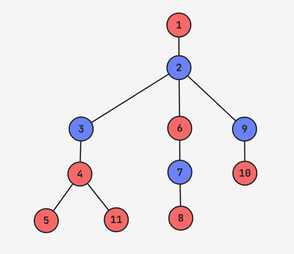

# F. The 67th Tree Problem

**time limit per test:** 4 seconds

**memory limit per test:** 256 megabytes

**input:** standard input

**output:** standard output

Now that PMOI season is over (Cloud emerged victorious), Macaque can continue on his journey towards enlightenment. The problems he is to solve are getting harder, the burden of the past lives is getting heavier, and you are losing your free will at such a rate that you struggle to remember the last time you did anything out of your own volition without being coerced by Macaque. The only upside for you is that Macaque is giving you a free tour of his current habitat up in the trees once you solve the following problem for him.

You are given two integers $x$ and $y$.

Your task is to construct a tree with $x + y$ nodes, rooted at node $1$, such that:

- Exactly $x$ nodes in the tree have even subtree$^{\text{∗}}$ size.
- Exactly $y$ nodes in the tree have odd subtree size.
 If multiple valid trees exist, you may output any of them. If there is no such tree, output NO.

$^{\text{∗}}$The subtree of a vertex $u$ is the set of all vertices that pass through $u$ on a simple path to the root (including $u$ itself).

#### Input

Each test contains multiple test cases. The first line contains the number of test cases $t$ ($1 \le t \le 10^4$). The description of the test cases follows.

Each subsequent line contains two integers $x$ and $y$ ($0 \leq x, y \leq 2 \cdot 10^5$, $1 \leq x + y \leq 2 \cdot 10^5$).

It is guaranteed that the sum of $x+y$ over all test cases does not exceed $2\cdot 10^5$.

#### Output

For each query, output "YES" or "NO", depending on whether or not a construction exists. You can output "YES" and "NO" in any case (for example, "yES", "yes", and "Yes" will be recognized as a positive response).

If you output "YES", output $x+y-1$ lines, each containing two space-separated integers $u$ and $v$, denoting that there is an edge between nodes $u$ and $v$.

#### Example

#### Input
```
7
1 1
2 1
0 3
3 4
0 2
1 0
4 7
```

#### Output
```
YES
1 2
NO
YES
1 2
1 3
YES
1 2
2 3
3 4
4 5
5 6
6 7
NO
NO
YES
1 2
2 3
3 4
4 5
4 11
2 6
6 7
7 8
2 9
9 10
```

#### Note

In the first test, the output tree is valid because node $1$ has subtree size $2$, which is even, and node $2$ has subtree size $1$, which is odd.

In the second test, it can be shown that no valid tree exists.

In the fourth test, the nodes with even subtree size are $[2, 4, 6]$, and the nodes with odd subtree size are $[1, 3, 5, 7]$.

The output of the final test is shown in the diagram below, where the blue nodes have even subtree size and the red nodes have odd subtree size.



