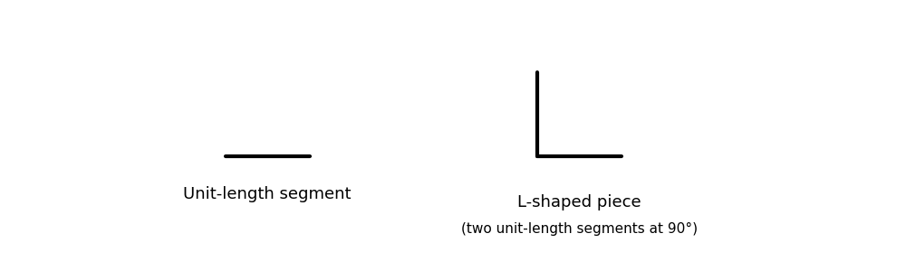

# A. Grid L

**time limit per test:** 2 seconds

**memory limit per test:** 256 megabytes

**input:** standard input

**output:** standard output

Roger has $p$ unit-length segments and $q$ L-shaped pieces, each formed by joining two unit-length segments at a right angle.





He wants to use all of these pieces, with no piece left unused, to form a grid of dimensions $n \times m$.

Given $p$ and $q$, determine whether there exist positive integers $n$ and $m$ such that an $n \times m$ grid can be formed using exactly $p$ unit-length segments and $q$ L-shaped pieces, possibly rotating them, and provide any valid $n$ and $m$.

#### Input

Each test contains multiple test cases. The first line contains the number of test cases $t$ ($1 \le t \le 100$). The description of the test cases follows.

The first line of each test case contains two integers $p$ and $q$ ($1 \le p, q \le 10^8$).

#### Output

For each test case, print any valid $n$ and $m$ such that it's possible to construct $n \times m$ using all pieces. If there are no such $n$ and $m$, print $-1$.

#### Example

#### Input
```
7
1 2
1 3
5 1
2 5
2 10
100000000 100000000
1 1
```

#### Output
```
-1
1 2
1 2
2 2
2 4
-1
-1
```

#### Note

Here are the constructions for examples 2, 3, and 4. We use a different color for different L-shaped pieces, black for all unit-length segments.


