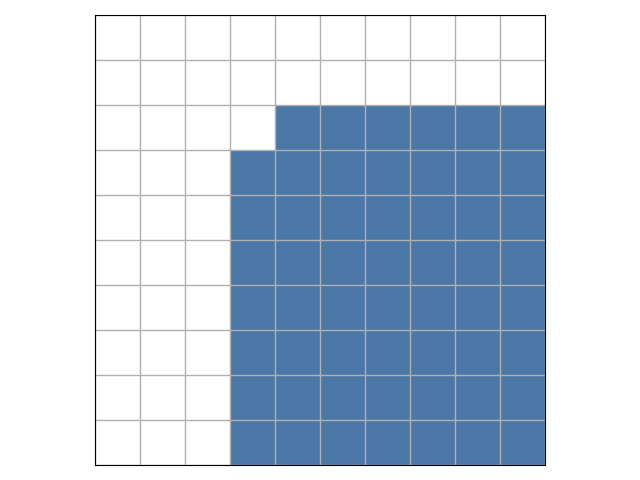

# E. Weird Chessboard

**time limit per test:** 5 seconds

**memory limit per test:** 256 megabytes

**input:** standard input

**output:** standard output

Consider a chessboard (a grid) of size $n \times n$. You want to place as many chess pieces on this board as possible. These pieces behave in the following way: if we denote the top-left cell by $(1,1)$, then a piece placed in cell $(i,j)$ can attack every cell $(x,y)$ such that $x \ge i$ and $y \ge j$, except for $(i,j)$ itself.

For example, on a $10 \times 10$ board, a piece placed at $(3,4)$ can attack the cells highlighted below:





Given a chessboard with some pieces placed on it, we say that a cell is good if the number of pieces that attack that cell is even.

Construct a configuration of pieces such that every cell is good, regardless of whether the cell itself contains a piece or not, and the board contains at least $\lfloor \frac{n^2}{10} \rfloor \cdot 3$ pieces.

#### Input

Each test contains multiple test cases. The first line contains the number of test cases $t$ ($1 \le t \le 50$). The description of the test cases follows.

The first line of each test case contains an integer $n$ ($1 \le n \le 5000$).

It is guaranteed that the sum of $n^2$ over all test cases is at most $25\,000\,000 = 5000^2$.

#### Output

For each test case, print $n$ lines. In the $i$-th line, print $n$ integers separated by spaces, where a $1$ represents that there is a piece in that cell, and a $0$ represents that there is not.

The $j$-th integer in the $i$-th line corresponds to cell $(i,j)$.

#### Example

#### Input
```
1
3
```

#### Output
```
0 0 1 
0 1 1 
1 0 1
```

#### Note

This example is a chessboard of dimensions $3 \times 3$ where every cell is good.

Cell $(3, 3)$ is good because the cells with pieces $(1, 3), (2, 3), (2, 2), (3, 1)$ attack it, and this count is 4, which is even.

Cell $(1, 3)$ is good because no piece attacks it, so the count of pieces that attack this cell is 0.

Cell $(3, 2)$ is good, and notice that it is required for that cell to be good even though it does not have a piece.
