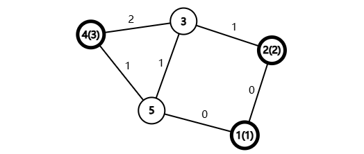
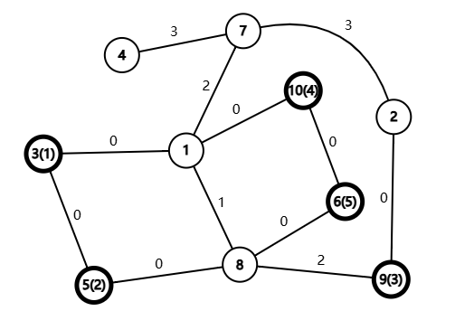

# F. Building Tree

**time limit per test:** 2.5 seconds

**memory limit per test:** 512 megabytes

**input:** standard input

**output:** standard output


[Shall We Talk (Tre Lune MMXIX)](<https://www.youtube.com/watch?v=NzAIFGFZzV8>)

Exber has an undirected graph with $n$ vertices and $m$ edges. The $i$-th edge connects vertices $u_i$ and $v_i$ and has weight $w_i$.

For every path, let the weights of the edges in it form a set $S$; then the length of this path is defined as $\operatorname{mex}(S)$. Here, $\operatorname{mex}(S)$ denotes the minimum excluded (MEX)$^{\text{∗}}$ of the collection $S$. Let $\mathrm{dis}(u,v)$ denote the minimum path length among all paths starting at $u$ and ending at $v$.

Now, Exber wants to construct a new graph with $q$ vertices. In the new graph, the color of the $i$-th vertex is $c_i$. Initially, there are no edges in this graph. If Exber adds an edge connecting vertex $u$ and vertex $v$, it will cost $\mathrm{dis}(c_u,c_v)$ time. If vertex $c_u$ and vertex $c_v$ are not connected in the given graph, Exber can not add an edge connecting vertex $u$ and vertex $v$ in the new graph.

Determine the minimum amount of time Exber needs to spend to make the new graph connected.

$^{\text{∗}}$The minimum excluded (MEX) of a collection of integers $S_1, S_2, \ldots, S_k$ is defined as the smallest non-negative integer $x$ which does not occur in the collection $S$.

#### Input

Each test contains multiple test cases. The first line contains the number of test cases $t$ ($1 \le t \le 10^4$). The description of the test cases follows.

The first line of each test case contains three integers $n$, $m$, and $q$ ($1\le n,m\le 3\cdot 10^5$, $1\le q\le n$) — the number of nodes in the graph, the number of edges in the graph, and the number of nodes in the new graph, respectively.

The next $m$ lines each contain three integers $u$, $v$, and $w$ ($1\le u,v\le n$, $0\le w\le m$), indicating that there is an edge of weight $w$ between vertices $u$ and $v$.

The next line contains $q$ integers $c_i$ ($1\le c_i\le n$), indicating that the color of vertex $i$ in the new graph is $c_i$.

It is guaranteed that the sum of $n$ over all test cases does not exceed $3\cdot 10^5$.

It is guaranteed that the sum of $m$ over all test cases does not exceed $3\cdot 10^5$.

It is guaranteed that the sum of $q$ over all test cases does not exceed $3\cdot 10^5$.

#### Output

For each test case, output a single integer — the minimum amount of time Exber needs to spend to make the new graph connected. If it is impossible, output $-1$.

#### Example

#### Input
```
4
5 6 3
1 2 0
2 3 1
3 4 2
3 5 1
5 1 0
4 5 1
1 2 4
10 12 5
7 2 3
5 8 0
8 9 2
1 8 1
3 5 0
10 6 0
7 4 3
1 10 0
3 1 0
1 7 2
2 9 0
6 8 0
3 5 9 10 6
10 12 5
8 2 0
10 1 1
6 10 0
4 2 3
4 3 2
3 8 3
10 7 0
4 5 1
6 4 0
2 10 0
1 3 0
7 9 0
6 1 7 9 5
5 4 2
5 1 0
5 2 0
1 2 1
3 4 2
1 3
```

#### Output
```
1
4
5
-1
```

#### Note

In the first test case, the original graph has $5$ vertices and $5$ edges. The colors of the vertices in the new graph are $1$, $2$, and $4$.




 The original graph of the first test case. The numbers inside the brackets represent the indices of the vertices in the new graph whose color is the index of this vertex in the original graph.
In the new graph, Exber will add edges $(1,2)$ and $(2,3)$, and the first edge will cost him $1$ time and the second edge will cost him $0$ time; therefore, the total time is $1$.

In the second test case, the original graph has $10$ vertices and $12$ edges. The colors of the vertices in the new graph are $3$, $5$, $9$, $10$, and $6$.




 The original graph of the second test case. The numbers inside the brackets represent the indices of the vertices in the new graph whose color is the index of this vertex in the original graph.
In the new graph, Exber will add edges $(1,2)$, $(2,3)$, $(3,4)$, and $(4,5)$, and each edge will cost him $1$ time; therefore, the total time is $4$.
