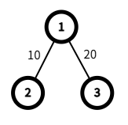
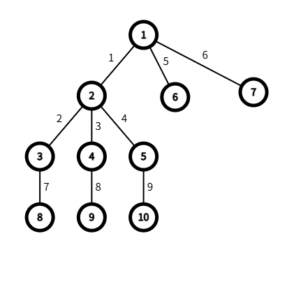

# C. Zhily and Signpost

**time limit per test:** 2 seconds

**memory limit per test:** 1024 megabytes

**input:** standard input

**output:** standard output

While returning to the base, Jily lost his way. He found that the paths ahead formed a tree. At every fork in the road, there was a signpost, but these signposts were affected by an anomalous magnetic field and kept rotating. Zhily became worried about Jily and wants to ask you several questions. Each time, given a specific moment, he asks which node Jily would eventually stop at if he started from the beginning.

You are given a tree with $n$ nodes, rooted at $1$. Node $u$ has $d_u$ children, sorted by node index in increasing order, namely $s_{u,0},\ldots,s_{u,d_u-1}$. It takes some time to cross each edge; specifically, the time needed to cross the edge between node $u$ and its parent is $l_u$.

Each non-leaf node in the tree has a signpost pointing to one of its children. When you are at such a node, you must immediately move to the child it points to, continuing in this way until you reach a leaf node, where you stop immediately.

The signposts change over time. At time $m$, the signpost of node $u$ points to its $(m\bmod d_u+1)$-th child, that is, node $s_{u,m \bmod d_u}$.

There are now $q$ queries. In each query, you are given $m$, and you need to determine the index of the leaf node you will eventually reach if you start from the root at time $m$.

#### Input

Each test contains multiple test cases. The first line contains the number of test cases $t$ ($1 \le t \le 10^4$). The description of the test cases follows.

The first line of each test case contains two positive integers $n,q$ ($1 \le n \le 5 \cdot 10^5,1 \le q \le 10^6$).

The second line contains $n-1$ positive integers $f_2,\ldots,f_n$ ($1 \le f_u \lt u$), where $f_u$ denotes the index of the parent of node $u$.

The third line contains $n-1$ non-negative integers $l_2,\ldots,l_n$ ($0 \le l_u \le 10^9$), where $l_u$ denotes the time needed to cross the edge between node $u$ and its parent.

The fourth line contains $q$ non-negative integers $m_1,\ldots,m_{q}$ ($0 \le m_i \le 10^{18}$), representing the $q$ queries.

It is guaranteed that the sum of $n$ over all test cases does not exceed $5 \cdot 10^5$.

It is guaranteed that the sum of $q$ over all test cases does not exceed $10^6$.

#### Output

For each test case, output one line containing $q$ positive integers, representing the answer to each query.

#### Example

#### Input
```
2
3 1
1 1
10 20
4
10 5
1 2 2 2 1 1 3 4 5
1 2 3 4 5 6 7 8 9
1 2 3 4 5
```

#### Output
```
2
6 7 9 6 7
```

#### Note

The tree in the first test case is shown below.




 If you start at time $4$, then at that moment the signpost of node $1$ points to node $2$. You will arrive at node $2$ at time $14$ and stop there.
The tree in the second test case is shown below.




 If you start at time $3$, then at that moment the signpost of node $1$ points to node $2$. You will arrive at node $2$ at time $4$. At that moment, the signpost of node $2$ points to node $4$, so you will arrive at node $4$ at time $7$. At that moment, the signpost of node $4$ points to node $9$, so you will arrive at node $9$ at time $15$ and stop there.
