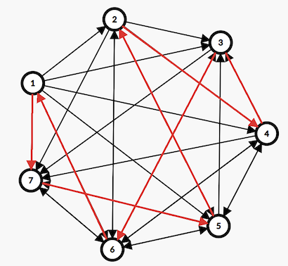

# D. Zhily and Cycle

**time limit per test:** 2 seconds

**memory limit per test:** 512 megabytes

**input:** standard input

**output:** standard output

Zhily and Jily resolved to travel across the entire world to eliminate all chaos. They start from a certain place and wish to visit every region exactly once.

You are given a directed graph with $n$ vertices numbered from $1$ to $n$. For each vertex $i$ ($1 \le i \le n$), there are directed edges from $i$ to all vertices $j$ such that $a_i \le j \le n$.

Find a Hamiltonian cycle$^{\text{∗}}$ of the graph.

$^{\text{∗}}$A Hamiltonian cycle is a cycle that visits each vertex exactly once.

#### Input

Each test contains multiple test cases. The first line contains the number of test cases $t$ ($1 \le t \le 10^4$). The description of the test cases follows.

The first line of each test case contains a single integer $n\,(1 \leq n \leq 10^5)$ — the number of vertices.

The second line of each test case contains $n$ integers $a_1,a_2,\cdots,a_n\,(1 \leq a_i \leq n)$ describing the graph.

It is guaranteed that the sum of $n$ across all test cases does not exceed $10^6$.

#### Output

For each test case, if no Hamiltonian cycle exists, output "No" in one line.

Otherwise, output "Yes" on the first line. On the second line, output a permutation $p_1, p_2, \dots, p_n$ ($1\le p_i\le n$) representing the order of vertices visited in the cycle. If there are multiple solutions, print any of them.

You can output the answer in any case (upper or lower). For example, the strings "yEs", "yes", "Yes", and "YES" will be recognized as positive responses.

#### Example

#### Input
```
5
7
1 3 6 3 2 1 5
9
4 2 9 8 5 8 5 7 9
8
3 4 4 5 6 1 8 2
1
1
5
5 4 2 5 5
```

#### Output
```
Yes
7 5 2 4 3 6 1
No
Yes
1 3 7 8 2 4 5 6
Yes
1
No
```

#### Note

In the first test case, the figure below illustrates a Hamiltonian cycle: $1 \to 7 \to 5 \to 2 \to 4 \to 3 \to 6 \to 1$.



In the second test case, no Hamiltonian cycle exists because there are no incoming edges to vertex $1$ (i.e., no vertex can reach vertex $1$).
