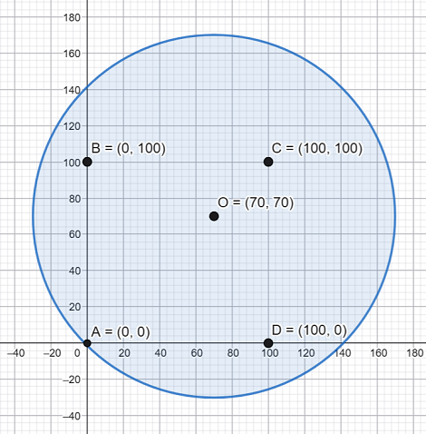

# E. Covering Points with Circles

**time limit per test:** 2 seconds

**memory limit per test:** 512 megabytes

**input:** standard input

**output:** standard output

You are given an array $p$ containing $n$ points with integer coordinates. These points are uniformly distributed inside some rectangle whose sides are parallel to the coordinate axes.

You need to place several circles so that the following conditions hold:

- the radius of each circle is equal to $r$, and its center has integer coordinates;
- for every pair of circles, the area of their intersection is $0$ (but the circles may touch);
- at least $89$% of all points lie inside some circle or on the boundary of some circle (in other words, the number of points lying inside the circles or on their boundaries is at least $\frac{89n}{100}$).

The rectangle in which the points from array $p$ are distributed is unknown to you, but in all tests except for the example it is guaranteed that the area of one circle of radius $r$ does not exceed $\frac{1}{10}$ of the area of this rectangle.

#### Input

The first line contains two integers $n$ and $r$ ($4 \le n \le 10^4$, $10^2 \le r \le 10^3$).

The next $n$ lines each contain two integers $p_{x}$ and $p_{y}$ ($-10^5 \le p_x, p_y \le 10^5$).

There are $40$ tests in this problem. For each test except the example from the statement, the following constraints hold:

- the number of points is $10^4$;
- all points are generated as follows: first, some integer $x$ from $300$ to $10^5$ is chosen; after that, $n$ distinct integer points are chosen uniformly at random in the rectangle $[-x, x] \times [-x, x]$;
- the area of a circle of radius $r$ does not exceed $\frac{1}{10}$ of the area of the rectangle $[-x, x] \times [-x, x]$;
- there exists a set of circles satisfying the conditions of the problem.

Hacks are disabled in this problem.

#### Output

In the first line, output one integer $k$ ($1 \le k \le n$) — the number of circles. In each of the next $k$ lines, output two integers $x$ and $y$ — the coordinates of the center of the $i$-th circle. The coordinates of centers of the circles you output should not exceed $2 \cdot 10^5$ by absolute value.

If there are multiple solutions, output any of them. You do not need to minimize the number of circles, but it should not exceed $n$.

#### Example

#### Input
```
4 100
0 0
0 100
100 0
100 100
```

#### Output
```
1
70 70
```

#### Note

One possible covering for the first sample is shown in the figure:



