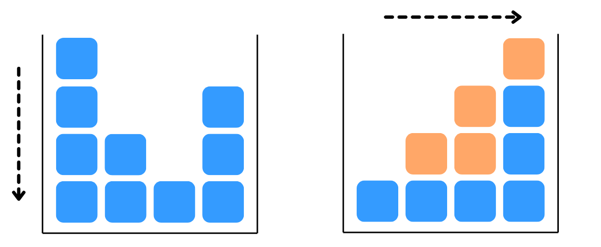

# F. It Just Keeps Going Sideways

**time limit per test:** 2 seconds

**memory limit per test:** 256 megabytes

**input:** standard input

**output:** standard output

Yousef has $n$ columns of cubes standing side by side. The $i$-th column contains $a_i$ identical unit cubes stacked vertically. Initially gravity pulls cubes downwards, so every column $i$ contains exactly $a_i$ cubes at heights $1, 2, \dots, a_i$.

Suddenly, gravity shifts to the right. Each cube slides horizontally as far to the right as possible. A cube cannot pass through or overlap other cubes, and it must remain at its original height. The final configuration is uniquely determined by the initial heights.




 Before and after applying rightward gravity.
Before the gravity shift, Yousef may perform at most one operation: choose an index $i$ and decrease $a_i$ by $1$ (i.e. remove one cube from that column). He may also choose to do nothing.

A cube's movement distance is defined as $|j - i|$, where $i$ is its original column index and $j$ is its column index after the gravity shift.

Find the maximum possible total movement distance (the sum of the movement distances of all remaining cubes) Yousef can achieve.

#### Input

The first line contains an integer $t$ ($1 \le t \le 10^4$) — the number of test cases. The description of the test cases follows.

The first line of each test case contains a single integer $n$ ($1 \le n \le 2 \cdot 10^5$) — the length of the array.

The second line of each test case contains $n$ integers $a_1, a_2, \dots, a_n$ ($1 \le a_i \le n$) — the elements of the array.

It is guaranteed that the sum of $n$ over all test cases does not exceed $2 \cdot 10^5$.

#### Output

For each test case, output a single integer — the maximum possible total movement distance (the sum of the movement distances of all remaining cubes) Yousef can achieve.

#### Example

#### Input
```
5
5
1 2 3 2 1
7
5 4 1 1 1 1 3
6
1 2 3 4 5 6
6
4 1 6 3 2 6
7
1 3 2 7 2 3 1
```

#### Output
```
9
37
0
17
29
```

#### Note

In the first test case, the initial total movement distance is $5$. If Yousef removes the cube at index $5$, the array becomes $[1, 2, 3, 2, 0]$. Because the fifth column is now empty, all cubes from the first four columns are able to slide further to the right than they could originally. This results in a new total distance of $9$.

In the third test case, the initial total movement distance is $0$. Even if Yousef removes any cube, no remaining cube will be able to move. This results in a total distance of $0$.
