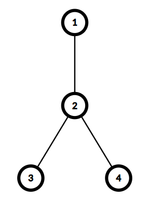
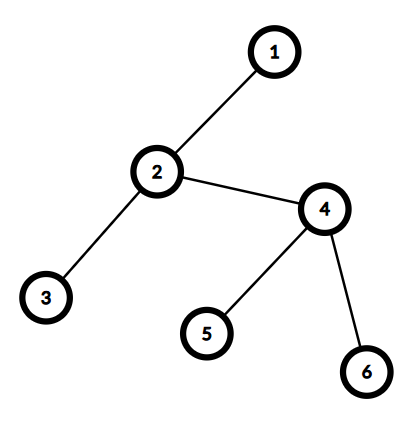

# H. Fallen Leaves

**time limit per test:** 2 seconds

**memory limit per test:** 256 megabytes

**input:** standard input

**output:** standard output

Yousef is given a tree$^{\text{∗}}$ of $n$ vertices numbered from $1$ to $n$.

Let $S$ be the set of all leaves$^{\text{†}}$ of the given tree (this set is determined from the original tree and does not change).

Yousef repeats the following process until the number of unchosen vertices is at most one:

- Choose two distinct vertices $u, v \in S$ that have not been chosen before.
- Add $d(u, v)$ to the total cost, where $d(u, v)$ is the number of edges on the simple path between $u$ and $v$.
- Mark $u$ and $v$ as chosen.

Your task is to help Yousef determine the minimum possible total cost achievable after the process ends.

$^{\text{∗}}$A tree is an undirected connected graph in which there are no cycles.

$^{\text{†}}$A leaf of a tree is a vertex that is connected to at most one other vertex.

#### Input

The first line contains an integer $t$ ($1 \le t \le 10^4$) — the number of test cases. Then $t$ test cases follow.

Each test case consists of several lines. The first line of the test case contains an integer $n$ ($3 \le n \le 2 \cdot 10^5$) — the number of vertices in the tree.

Then $n − 1$ lines follow, each of which contains two integers $u$ and $v$ ($1 \le u, v \le n$, $u \ne v$) that describe a pair of vertices connected by an edge. It is guaranteed that the given graph is a tree and has no loops or multiple edges.

It is guaranteed that the sum of $n$ over all test cases does not exceed $2 \cdot 10^5$.

#### Output

For each test case, output a single integer — the minimum possible total cost achievable after the process ends.

#### Example

#### Input
```
4
4
1 2
2 3
2 4
6
1 2
2 3
2 4
4 5
4 6
7
1 2
2 3
3 4
2 5
5 6
5 7
5
1 2
1 3
3 4
3 5
```

#### Output
```
2
4
5
2
```

#### Note

In the first test case, the set of leaves $S$ contains $\{1, 3, 4\}$. Yousef can do the following:

- Choose $u = 1$, $v = 3$, with $d(1, 3) = 2$. Yousef adds $2$ to the total cost and marks vertices $1$ and $3$ as chosen.

Since there is one vertex left unchosen, the process stops, and the total cost is $2$. It can be shown that $2$ is the minimum answer.




 The given tree in the first test case.
In the second test case, the set of leaves $S$ contains $\{1, 3, 5, 6\}$. Yousef can do the following:

- Choose $u = 1$, $v = 3$, with $d(1, 3) = 2$. Yousef adds $2$ to the total cost and marks vertices $1$ and $3$ as chosen.
- Choose $u = 5$, $v = 6$, with $d(5, 6) = 2$. Yousef adds $2$ to the total cost and marks vertices $5$ and $6$ as chosen.

Since there is no vertex left unchosen, the process stops, and the total cost is $4$.




 The given tree in the second test case.
