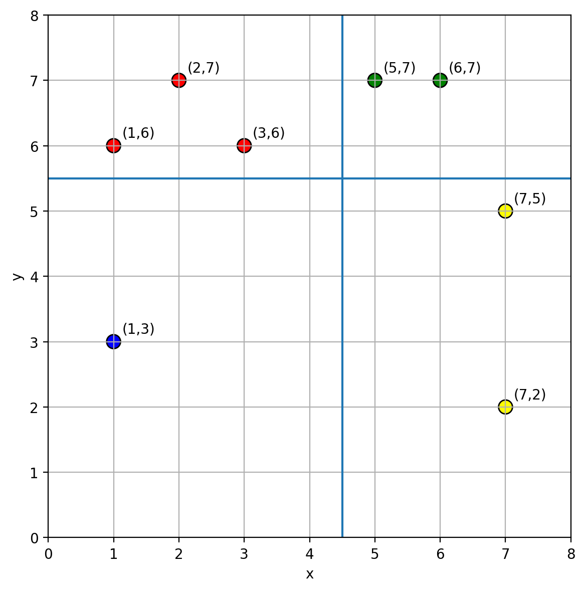

# D. Sanae, Cross and Color

**time limit per test:** 2 seconds

**memory limit per test:** 256 megabytes

**input:** standard input

**output:** standard output


Faith Is for the Transient People

— Mountain of Faith

Upon the mountain, Sanae gazes at the stars. Faith, for her, is where winds encounter one another and choices diverge, and it is the point where all directions meet. For the glory of the Holy Cross, let us trace the sign of faith together.

There are $n$ distinct integer points in the plane, where the $i$-th point is located at $(x_i,y_i)$. To color the points, choose two integers $k_1$ and $k_2$ such that each of the four regions divided by the lines $x=k_1+0.5$ and $y=k_2+0.5$ contains at least one point. Each point $(x,y)$ is colored according to the region it lies in:

- Top-left ($x\leq k_1$ and $y \gt k_2$): the point is colored red.
- Top-right ($x \gt k_1$ and $y \gt k_2$): the point is colored green.
- Bottom-left ($x\leq k_1$ and $y\leq k_2$): the point is colored blue.
- Bottom-right ($x \gt k_1$ and $y\leq k_2$): the point is colored yellow.




 A valid coloring of the third test case, where $k_1=4$ and $k_2=5$.
Find the number of distinct colorings, where two colorings are considered distinct if and only if there exists at least one point colored differently, regardless of the choice of $k_1$ and $k_2$.

#### Input

Each test contains multiple test cases. The first line contains the number of test cases $t$ ($1 \le t \le 10^4$). The description of the test cases follows.

The first line of each test case contains an integer $n$ ($4 \leq n \leq 2 \cdot 10^6$).

The following $n$ lines each contain two integers $x_i$, $y_i$ ($1 \leq x_i, y_i \leq n$), representing the coordinates of the $i$-th point.

It is guaranteed that the points are pairwise distinct in each test case.

It is guaranteed that the sum of $n$ over all test cases does not exceed $2\cdot 10^6$.

#### Output

For each test case, output the number of distinct colorings.

#### Example

#### Input
```
5
4
1 1
2 2
3 3
4 4
4
1 4
4 1
1 1
4 4
8
7 2
5 7
2 7
1 3
6 7
3 6
7 5
1 6
8
6 1
3 6
1 4
1 1
4 2
5 5
3 4
4 1
6
5 5
5 4
3 5
1 5
5 3
2 2
```

#### Output
```
0
1
12
8
4
```

#### Note

In the first test case, no valid cross exists.

In the second test case, choosing $x = y = 2$ yields a valid coloring. It can be proved that this coloring is unique.

In the third test case, a valid coloring is shown in the legend.
