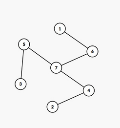

# E. Deconstruction Tree

**time limit per test:** 2 seconds

**memory limit per test:** 256 megabytes

**input:** standard input

**output:** standard output


A tree with $n$ nodes fell from the sky along with an initially empty set $S$. Ecstatic by this unlikely event, you do the following $n - 1$ times:

- let $x$ be the leaf with maximum index.
- add $x$ into $S$ (note that if $x$ is already in $S$ then nothing changes).
- select any leaf other than $x$ and remove it from the tree.

Determine the number of distinct sets $S$ you can make. As the number could be ginormous, output it modulo $998\,244\,353$.

#### Input

Each test contains multiple test cases. The first line contains the number of test cases $t$ ($1 \le t \le 10^4$). The description of the test cases follows.

The first line of each testcase contains an integer $n$ ($2 \le n \le 2 \cdot 10^5$) — the size of the tree.

Then $n - 1$ lines follow, each of which contain two integers $u$ and $v$ ($1 \le u,v \le n, u \ne v$), which describe a pair of vertices connected by an edge. It is guaranteed that the given graph is a tree.

It is guaranteed that the sum of $n$ over all test cases does not exceed $2 \cdot 10^5$.

#### Output

Output the number of distinct sets that can be obtained modulo $998\,244\,353$.

#### Example

#### Input
```
6
2
1 2
5
5 1
5 3
5 4
5 2
7
7 6
7 4
5 7
1 6
2 4
3 5
10
10 9
10 8
10 7
10 6
9 5
8 4
7 3
6 2
5 1
4
2 4
3 1
1 4
4
1 4
2 3
3 4
```

#### Output
```
1
1
3
13
1
1
```

#### Note

For the first testcase, there is only one possible order: $1$, making the set $\{2\}$

For the third testcase, the tree looks as follows:





you can make the sets:

- $\{3, 6, 7\}$ by removing in the order $1, 2, 3, 4, 5, 6$
- $\{3, 4, 6, 7\}$ by removing in the order $2, 1, 3, 4, 5, 6$
- $\{3, 4, 5, 6, 7\}$ by removing in the order $2, 3, 1, 4, 5, 6$

It can be proven that these are the only sets obtainable.
