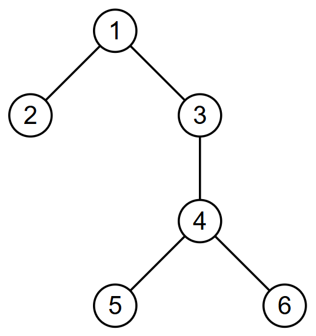

# I. The Endians

**time limit per test:** 2 seconds

**memory limit per test:** 1024 megabytes

**input:** standard input

**output:** standard output


You are given a tree of $n$ nodes, where node $i$ has weight $w_i$, and an integer $k$.

Let the tree be rooted at node $x$. You may select a subset $S$ of the nodes such that $|S| = k$ and $x \in S$. Let $f(i)$ be the sum of the weights of all nodes in $S$ on the path from node $i$ to the root. The score of $S$ is $\sum_{i \in S} f(i)$.

For each node $1 \le x \le n$, find the maximum possible score among all subsets $S$ if the tree is rooted at node $x$.

#### Input

Each test contains multiple test cases. The first line contains the number of test cases $t$ ($1 \le t \le 500$). The description of the test cases follows.

The first line of each test case contains two integers $n$ and $k$ ($2 \le n \le 4000$, $1 \le k \le n$).

The second line of each test case contains $n$ integers $w_1, w_2,\ldots, w_n$ ($1 \le w_i \le 10^9$).

Each of the next $n - 1$ lines contains two integers $u$ and $v$ ($1 \le u, v \le n$), indicating that nodes $u$ and $v$ are connected by an edge. It is guaranteed that the given graph is a tree.

It is guaranteed that the sum of $n$ over all test cases does not exceed $4000$.

#### Output

For each test case, print $n$ integers. For each $x$ from $1$ to $n$, print the maximum possible score among all subsets $S$ if the tree is rooted at node $x$.

#### Example

#### Input
```
3
6 3
2 12 3 6 9 7
1 2
1 3
3 4
4 5
4 6
5 5
10000 1000 100 10 1
1 2
2 3
3 4
3 5
9 5
7 11 5 16 13 10 12 9 15
8 1
1 6
3 7
4 6
6 7
6 5
9 1
2 8
```

#### Output
```
27 57 30 39 51 45 
54311 15311 12511 12451 12415 
120 150 134 170 155 122 150 132 162 
```

#### Note

In the first test case, the tree is as follows:





For each $1 \le x \le n$, the following is an optimal set $S$:

- $x = 1$: $S = \{1, 2, 5\}$; the score is $(2) + (12 + 2) + (9 + 2) = 27$,
- $x = 2$: $S = \{2, 4 ,5\}$; the score is $(12) + (6 + 12) + (9 + 6 + 12) = 57$,
- $x = 3$: $S = \{2, 3, 5\}$; the score is $(12 + 3) + (3) + (9 + 3) = 30$,
- $x = 4$: $S = \{2, 4, 5\}$; the score is $(12 + 6) + (6) + (9 + 6) = 39$,
- $x = 5$: $S = \{2, 4 ,5\}$; the score is $(12 + 6 + 9) + (6 + 9) + (9) = 51$,
- $x = 6$: $S = \{2 ,4, 6\}$; the score is $(12 + 6 + 7) + (6 + 7) + (7) = 45$.

In the second test case, $S = \{1, 2, 3, 4, 5\}$ for all $x$.
