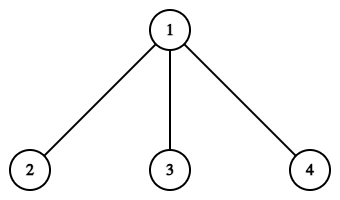
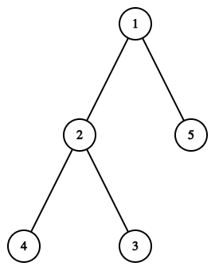
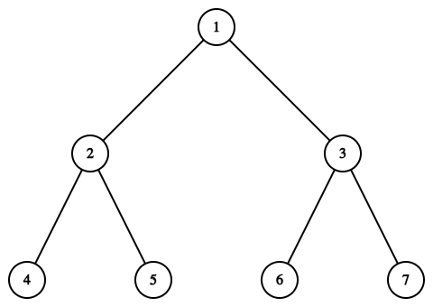

# E. Graph Cutting

**time limit per test:** 2 seconds

**memory limit per test:** 256 megabytes

**input:** standard input

**output:** standard output

For his birthday, young Fedya was given a tree with $n$ vertices and a chainsaw. He wants to cut out a connected subgraph from it. Fedya decided to act as follows: he chooses three distinct vertices $a, b, c$ ($a \lt b \lt c$), and cuts out the minimal connected subgraph containing all three vertices. He wants the size of the resulting subgraph to be exactly $d$ (that is, the number of vertices in the cut-out subgraph must be equal to $d$).

He became interested in how many different such subgraphs he can cut out. Subgraphs are considered different if the chosen triples of vertices are different. Help him solve this problem!

#### Input

Each test contains multiple test cases. The first line contains the number of test cases $t$ ($1 \le t \le 500$). The description of the test cases follows.

The first line of each test case contains two integers $n$ and $d$ ($3 \le d \leq n \le 2000$) — the number of vertices in the tree and the desired size of the cut-out subgraph.

Then follow $n - 1$ lines, each containing two integers $u$ and $v$ ($1 \le u, v \le n$, $u \neq v$), meaning the vertices connected by the corresponding edge. It is guaranteed that the given graph is a tree.

It is guaranteed that the sum of $n$ over all test cases does not exceed $2000$.

#### Output

For each test case, output a single number — the number of different subgraphs that Fedya can cut out.

#### Example

#### Input
```
3
4 3
1 2
3 1
4 1
5 5
1 2
2 4
2 3
5 1
7 7
1 2
1 3
2 4
2 5
3 6
3 7
```

#### Output
```
3
1
0
```

#### Note

This is what the tree looks like for the first test case:





The following triples are suitable: ($1, 2, 3$), ($1, 2, 4$), ($1, 3, 4$). But for the triple ($2, 3, 4$), the size of the connected subgraph is $4$.

This is what the tree looks like for the second test case:





For it, only the triple of vertices ($3, 4, 5$) is suitable.

This is what the tree looks like for the third test case:





It can be shown that no triple is suitable for this subgraph.
