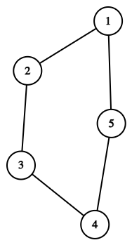
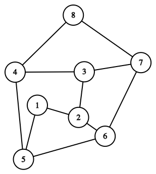

# F. Quadratic Jumps

**time limit per test:** 2 seconds

**memory limit per test:** 256 megabytes

**input:** standard input

**output:** standard output

You are given two integers $n$ and $q$. Consider a graph with $n$ vertices, where vertices $i$ and $j$ are connected by an edge if and only if $|j - i|$ is a perfect square$^{\text{∗}}$.

You are given $q$ pairs of numbers $a_i, b_i$. For each of these $q$ pairs, you need to find the shortest distance between vertices $a_i$ and $b_i$ in this graph. It can be proved that the graph is connected, so the distance between $a_i$ and $b_i$ is not infinite.

$^{\text{∗}}$An integer $x$ is a perfect square if there exists an integer $y$ such that $x = y^2$.

#### Input

Each test contains multiple test cases. The first line contains the number of test cases $t$ ($1 \le t \le 1000$). The description of the test cases follows.

The first line of each test case contains two integers $n$ and $q$ ($2 \le n \le 2 \cdot 10^5$, $1 \le q \le 10^5$) — the number of vertices in the graph and the number of pairs of vertices for which the distance must be found.

Then the next $q$ lines describe the pairs of vertices for which the shortest distance must be found. Each pair is described by two numbers $a, b$ ($1 \leq a \lt b \leq n$) — the numbers of the vertices between which the shortest distance must be found.

It is guaranteed that the sum of $n$ over all test cases does not exceed $2 \cdot 10^5$, and the sum of $q$ over all test cases does not exceed $10^5$.

#### Output

For each test case, output the shortest distance between each of the $q$ pairs of vertices.

#### Example

#### Input
```
2
5 4
1 2
1 3
1 4
1 5
8 3
3 7
2 5
1 7
```

#### Output
```
1
2
2
1
1
2
3
```

#### Note

This is what the graph looks like for the first test case:





- For the first pair of vertices, the shortest path is $1 \rightarrow 2$.
- For the second pair of vertices, the shortest path is $1 \rightarrow 2 \rightarrow 3$.
- For the third pair of vertices, the shortest path is $1 \rightarrow 5 \rightarrow 4$.
- For the fourth pair of vertices, the shortest path is $1 \rightarrow 5$.

This is what the graph looks like for the second test case:





- For the first pair of vertices, the shortest path is $1 \rightarrow 2$.
- For the second pair of vertices, the shortest path is $2 \rightarrow 6 \rightarrow 5$.
- For the third pair of vertices, the shortest path is $1 \rightarrow 2 \rightarrow 6 \rightarrow 7$.
