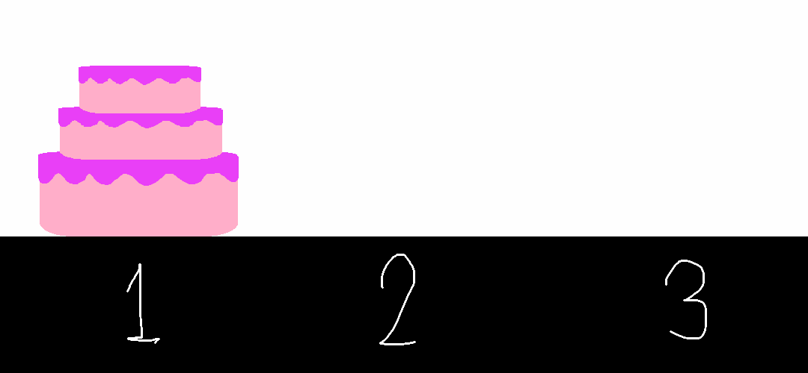

# D. Magical Tiered Cake

**time limit per test:** 2 seconds

**memory limit per test:** 256 megabytes

**input:** standard input

**output:** standard output

Alice has finished a magical tiered cake with $n$ magical layers, where each layer is smaller than all layers below it (i.e. the first layer is the smallest, the $n$-th layer is the largest). Now, she needs your help to transport it from her kitchen to the party site. Since moving the whole cake at once is impossible, she also prepares a warehouse for you to ease the transportation process.

Since the cake is magical, the $i$-th layer of cake is movable if and only if there are exactly $a_i$ layers of cake above it.

In each move, you can choose exactly one movable layer of cake from any location and move it on top of the tiered cake in any other location. However, to preserve a structure of the cake, the moved layer has to be on the layer that is strictly larger than it if there is a tiered cake at the destination. For example, you cannot move a layer with size $4$ on top of a location where there is already a layer with size $3$.

The party is starting soon, so we need to move fast. Help Alice transport the cake to the party within $2^n$ moves or report that it is impossible.

#### Input

Each test contains multiple test cases. The first line contains the number of test cases $t$ ($1 \le t \le 10000$). The description of the test cases follows.

The first line of each test case contains an integer $n$ ($1 \le n \le 20$) – the number of layers in the magical tiered cake.

The second line of each test case contains $n$ integers $a_1,a_2,\ldots,a_n$ ($0 \leq a_i \leq n$), which represent how many layers of cake need to be above the $i$-th layer for it to be movable.

It is guaranteed that the sum of $2^n$ across all test cases does not exceed $2^{20}$.

#### Output

For each test case, if it is impossible to move the magical tiered cake to the party site, output NO.

Otherwise, on the first line, output YES.

Then, on the next line, output an integer $k$ ($0 \leq k \leq 2^n$) – the number of moves you make to transport the cake.

For the following $k$ lines, output integers $\mathrm{id}$, $\mathrm{from}$, $\mathrm{to}$ ($1 \le \mathrm{id} \le n, 1 \le \mathrm{from}, \mathrm{to} \le 3$): the layer of cake you want to move, its current location, and its destination, where $1$ represents Alice's kitchen, $2$ represents Alice's warehouse, and $3$ represents the party site.

#### Example

#### Input
```
3
3
0 0 0
3
0 1 2
3
2 2 2
```

#### Output
```
YES
7
1 1 3
2 1 2
1 3 2
3 1 3
1 2 1
2 2 3
1 1 3
YES
3
3 1 3
2 1 3
1 1 3
NO
```

#### Note

The visualization of the solution to test case $1$ and $2$ is shown in the gif below:




In the third test case, it can be shown it is impossible to move all layers of the cake to the party site.
