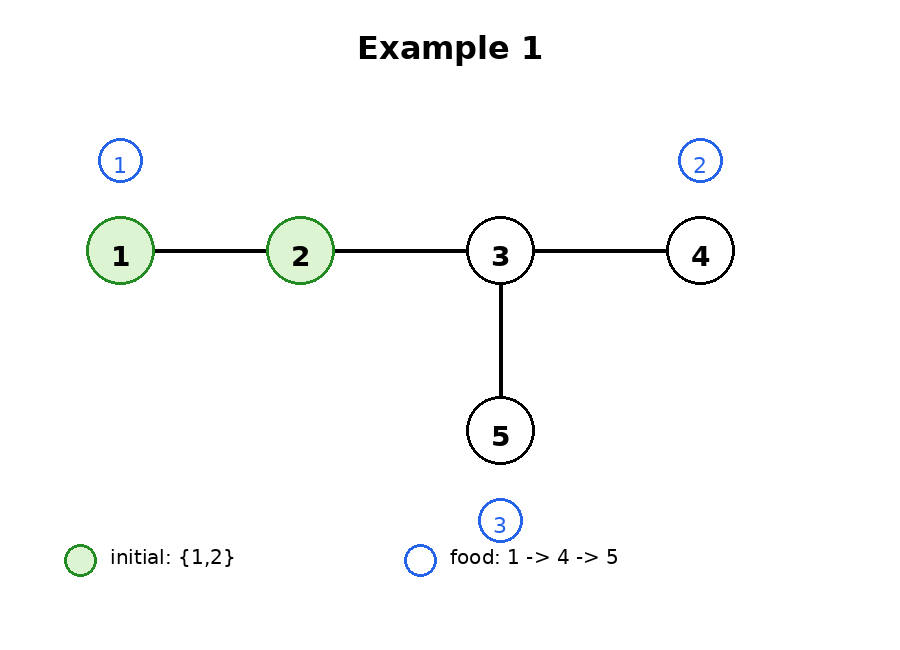
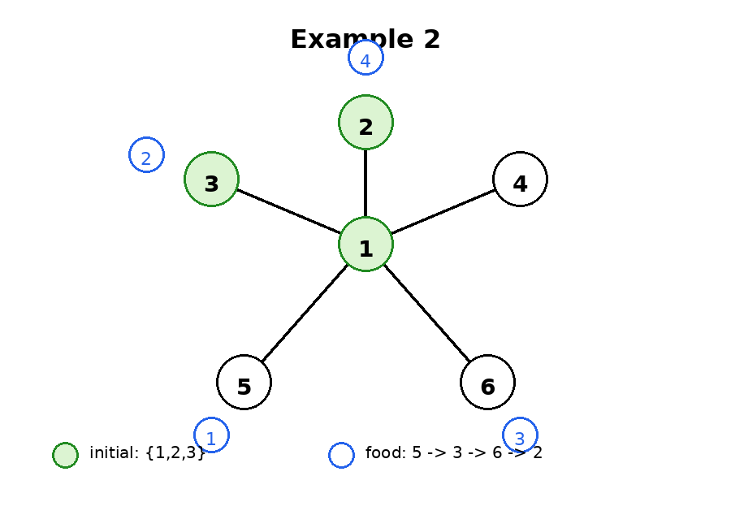
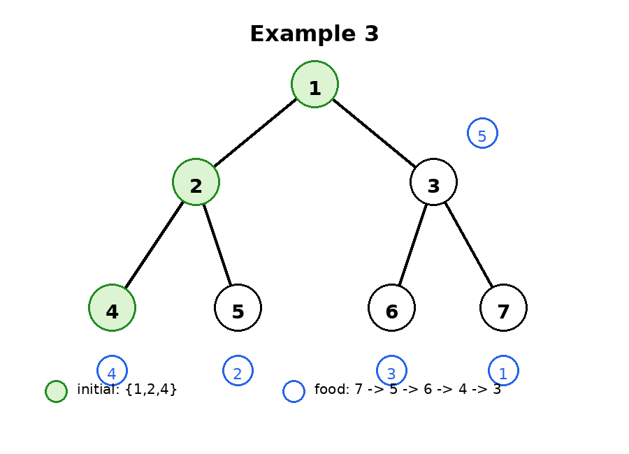

# H. Slime and Queries

**time limit per test:** 5 seconds

**memory limit per test:** 1024 megabytes

**input:** standard input

**output:** standard output


You are given a tree with $n$ vertices numbered from $1$ to $n$. A slime occupies exactly $m$ vertices of the tree. It is guaranteed that the subgraph induced by the occupied vertices is connected.

Initially, the slime occupies vertices $s_1,s_2,\ldots,s_m$.

First, we define a function $f$ on a sequence of vertices. Consider a sequence $a_1,a_2,\ldots,a_k$. There are $k$ pieces of food. For each $i$, the $i$-th piece of food is located at vertex $a_i$. At first, only the first piece of food appears.

The slime may perform the following operations any number of times:

- Move. The slime removes itself from one currently occupied vertex and expands to one currently unoccupied vertex.Formally, let $S$ be the current set of occupied vertices. Choose a vertex $u\in S$ and a vertex $v\notin S$, and replace $S$ with $(S\setminus{u})\cup{v}$. After the operation, the subgraph induced by $S$ must still be connected.
- Eat. If the $i$-th piece of food has appeared and the slime currently occupies vertex $a_i$, then the slime may eat the $i$-th piece of food. If $1\le i \lt k$, the $(i+1)$-th piece of food appears immediately after that. Eating does not change the occupied vertices.

Define $f([a_1,a_2,\ldots,a_k])$ as the minimum number of Move operations needed for the slime to eat all $k$ pieces of food in order, starting from the initial occupied vertices $s_1,s_2,\ldots,s_m$.

There are $q$ queries. The input is forced online. The input gives encoded values $p_1,p_2,\ldots,p_q$. Let $\mathrm{ans}_0=0$. For each $i=1,2,\ldots,q$, the actual vertex of the $i$-th query is $c_i=((p_i-1+\mathrm{ans}_{i-1}) \bmod n)+1$, where $\mathrm{ans}_i=f([c_1,c_2,\ldots,c_i])$.

For each $i=1,2,\ldots,q$, output $\mathrm{ans}_i$.

#### Input

Each test contains multiple test cases. The first line contains the number of test cases $t$ ($1 \le t \le 10^4$). The description of the test cases follows.

The first line of each test case contains three integers $n$, $m$, and $q$ ($2\le m\le n\le 10^5$, $1\le q\le 10^5$) — the number of vertices in the tree, the number of vertices occupied by the slime, and the number of queries.

Each of the next $n-1$ lines contains two integers $u$ and $v$ ($1\le u,v\le n$, $u\ne v$), denoting an edge of the tree.

The next line contains $m$ distinct integers $s_1,s_2,\ldots,s_m$ ($1\le s_i\le n$) — the vertices initially occupied by the slime. It is guaranteed that these vertices induce a connected subgraph.

The next line contains $q$ integers $p_1,p_2,\ldots,p_q$ ($1\le p_i\le n$) — the encoded query vertices.

It is guaranteed that the sum of $n$ over all test cases does not exceed $10^5$.

It is guaranteed that the sum of $q$ over all test cases does not exceed $10^5$.

#### Output

For each test case, output $q$ integers. The $i$-th integer should be $\mathrm{ans}_i$.

#### Example

#### Input
```
10
5 2 3
3 5
2 1
4 3
3 2
1 2
1 4 3
6 3 4
5 1
1 3
6 1
4 1
2 1
1 2 3
5 2 5 6
7 3 5
3 7
4 2
1 3
2 1
6 3
5 2
1 2 4
7 3 2 5 2
5 2 5
3 1
1 5
2 1
4 1
1 2
3 3 3 4 2
6 3 6
4 6
3 2
1 2
5 4
2 4
2 4 5
6 6 1 2 4 6
7 4 5
5 2
3 1
2 1
3 7
6 3
4 2
1 2 3 4
7 4 4 5 1
4 3 4
3 1
1 4
2 1
1 2 3
4 1 2 3
6 2 5
2 4
5 4
2 1
6 4
3 2
1 2
6 1 1 1 2
7 2 5
2 4
7 3
3 6
1 3
1 2
5 2
1 2
4 6 1 6 5
8 4 6
5 2
3 2
7 5
4 3
8 7
1 2
6 5
2 3 4 5
8 7 3 3 7 8
```

#### Output
```
0 2 3 
1 1 2 3 
2 4 6 8 9 
1 2 3 4 4 
1 2 3 4 4 4 
1 2 3 3 4 
1 1 2 2 
2 4 6 8 9 
1 4 7 10 11 
2 3 4 4 5 5 
```

#### Note

In the explanations below, the underlined vertex is the newly occupied vertex after a Move, and vertices where the slime eats food are written in bold.





In the first test case, after decoding, the food appears at vertices $1,4,5$ in order. Initially, the slime occupies $[1,2]$.

- For $[1]$, the slime already occupies vertex $\mathbf{1}$, so $\mathrm{ans}_1=0$.
- For $[1,4]$, one optimal process is $[\mathbf{1},2]\to[2,\underline{3}]\to[3,\underline{\mathbf{4}}]$, so $\mathrm{ans}_2=2$.
- For $[1,4,5]$, one optimal process is $[\mathbf{1},2]\to[2,\underline{3}]\to[3,\underline{\mathbf{4}}]\to[3,\underline{\mathbf{5}}]$, so $\mathrm{ans}_3=3$.





In the second test case, after decoding, the food appears at vertices $5,3,6,2$ in order. Initially, the slime occupies $[1,2,3]$.

- For $[5]$, one optimal process is $[1,2,3]\to[1,3,\underline{\mathbf{5}}]$, so $\mathrm{ans}_1=1$.
- For $[5,3]$, the same process also lets the slime eat at vertex $\mathbf{3}$, so $\mathrm{ans}_2=1$.
- For $[5,3,6]$, one optimal process is $[1,2,3]\to[1,3,\underline{\mathbf{5}}]\to[1,3,\underline{\mathbf{6}}]$, so $\mathrm{ans}_3=2$.
- For $[5,3,6,2]$, one optimal process is $[1,2,3]\to[1,3,\underline{\mathbf{5}}]\to[1,3,\underline{\mathbf{6}}]\to[1,\underline{\mathbf{2}},3]$, so $\mathrm{ans}_4=3$.





In the third test case, after decoding, the food appears at vertices $7,5,6,4,3$ in order. Initially, the slime occupies $[1,2,4]$.

- For $[7]$, one optimal process is $[1,2,4]\to[1,2,\underline{3}]\to[1,3,\underline{\mathbf{7}}]$, so $\mathrm{ans}_1=2$.
- For $[7,5]$, one optimal process is $[1,2,4]\to[1,2,\underline{3}]\to[1,3,\underline{\mathbf{7}}]\to[1,\underline{2},3]\to[1,2,\underline{\mathbf{5}}]$, so $\mathrm{ans}_2=4$.
- For $[7,5,6]$, one optimal process is $[1,2,4]\to[1,2,\underline{3}]\to[1,3,\underline{\mathbf{7}}]\to[1,\underline{2},3]\to[1,2,\underline{\mathbf{5}}]\to[1,2,\underline{3}]\to[1,3,\underline{\mathbf{6}}]$, so $\mathrm{ans}_3=6$.
- For $[7,5,6,4]$, continue with $[1,3,\mathbf{6}]\to[1,\underline{2},3]\to[1,2,\underline{\mathbf{4}}]$, so $\mathrm{ans}_4=8$.
- For $[7,5,6,4,3]$, continue with $[1,2,\mathbf{4}]\to[1,2,\underline{\mathbf{3}}]$, so $\mathrm{ans}_5=9$.

In the fourth test case, after decoding, the food appears at vertices $3,4,5,2,1$.

In the fifth test case, after decoding, the food appears at vertices $6,1,3,5,2,4$.

In the sixth test case, after decoding, the food appears at vertices $7,5,6,1,4$.
