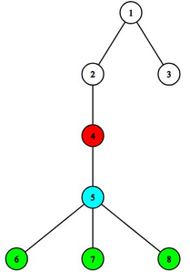
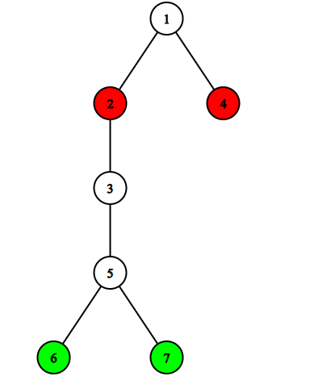

# C. Village Guilds

**time limit per test:** 2 seconds

**memory limit per test:** 256 megabytes

**input:** standard input

**output:** standard output


Hmmmrmm.

— Minecraft

During his long adventure, Steve stumbled upon a village of villagers. The houses in the village are connected by bidirectional paths. In total, there are $n$ houses in the village, numbered from $1$ to $n$. The graph of houses and paths represents a rooted$^{\text{∗}}$ tree$^{\text{†}}$, rooted at vertex $1$, where the town hall is located.

Consider an arbitrary house $v$ and its subtree$^{\text{‡}}$. For each such house $v$ and each non-negative integer $h$, consider the set of houses that are in the subtree of $v$ at a distance exactly $h$ from $v$. Such a set will be called a guild. For example, for $h=0$, the guild will consist only of the vertex $v$.

In the example below, the guilds for the vertex $v=4$ are shown. The guild for $h=0$ is marked in red, for $h=1$ in light blue, and for $h=2$ in green.





Two guilds are considered different if there exists a house that is in one guild and not in the other. Steve wants to know how many different non-empty guilds there are in the tree. Help him with this.

$^{\text{∗}}$A rooted tree is a tree where one vertex is special and called the root.

$^{\text{†}}$A tree is a connected graph without cycles.

$^{\text{‡}}$A subtree of vertex $v$ is the subgraph of $v$, all its descendants, and all the edges between them.

#### Input

Each test contains multiple test cases. The first line contains the number of test cases $t$ ($1 \le t \le 10^4$). The description of the test cases follows.

The first line of each test case contains a single integer $n$ ($2 \le n \le 2 \cdot 10^5$) — the number of houses in the village.

The second line contains $n-1$ integers $p_2, p_3, \ldots, p_n$ ($1 \le p_i \lt i$), where $p_i$ is the parent of the $i$-th house in the tree.

It is guaranteed that the sum of $n$ over all test cases does not exceed $2 \cdot 10^5$.

#### Output

For each test case, output a single integer — the number of different guilds in the village.

#### Example

#### Input
```
5
5
1 2 3 4
3
1 1
7
1 2 1 3 5 5
10
1 1 3 2 2 4 4 4 3
15
1 2 1 3 3 4 3 7 3 10 6 7 1 9
```

#### Output
```
5
4
9
15
22
```

#### Note

In the first testcase, there are $5$ guilds, each consisting of a single house.

In the second testcase, in addition to the guilds consisting of a single house, there is also a guild consisting of vertices $2$ and $3$. It can be obtained by considering houses at distance $h=1$ in the subtree of vertex $v=1$.

In the third testcase, in addition to the guilds consisting of a single house, there are $2$ more guilds: for $v=1$ and $h=1$, the guild consists of vertices $2$ and $4$; for $v=5$, $h=1$, the guild consists of vertices $6$ and $7$.



