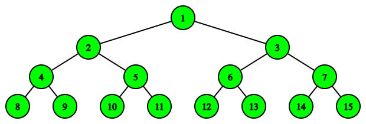
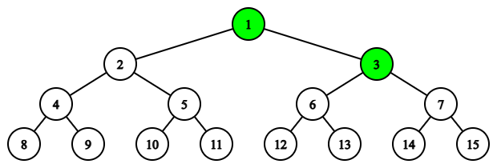
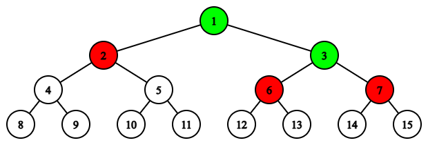

# F. Infinite Work

**time limit per test:** 2.5 seconds

**memory limit per test:** 256 megabytes

**input:** standard input

**output:** standard output

More monkeys!

— Exponential Idle

You are in charge of a large scientific project studying an unusual function. To carry it out, you hired $10^{10^{100}}$ students and numbered them with natural numbers from $1$ to $10^{10^{100}}$. The students form a hierarchy:

- Student $1$ is the main one.
- For any $i \geq 2$, the direct supervisor of student $i$ is student $\left\lfloor \frac{i}{2} \right\rfloor$.
- The direct subordinates of student $i$ are students $2i$ and $2i+1$ (if these numbers do not exceed $10^{10^{100}}$).
- Subordination is transitive: if $a$ is subordinate to $b$, and $b$ is subordinate to $c$, then $a$ is subordinate to $c$.
 Initially, all students are working.
There are $n$ days left until the project is completed. Each day consists of two stages:

- Hiring. Each working student $i$ hires all the non-working students who are directly subordinate to him:

 - If student $2i$ is not working and $2i \leq 10^{10^{100}}$, he starts working.
 - If student $2i + 1$ is not working and $2i + 1 \leq 10^{10^{100}}$, he starts working.
 Newly hired students cannot hire anyone on the same day.
- Firing. You may choose any set of working students and directly fire each of them. If student $i$ is directly fired, then all of his subordinates are automatically fired as well. Such firings are called indirect. Student $1$ cannot be fired.

Additional restriction: Each student may be fired (directly or indirectly) at most once. If a previously fired student is hired again, it is forbidden to perform a firing that would cause this student to be fired again.

Below (showing only the first $15$ students) are examples of how to choose students for direct firing on each day so that after $2$ days exactly $5$ students remain. The number at the top corresponds to the student number, edges show subordination.

Students who are working and have not been fired are marked green, students who have been fired are marked white, and students who were previously fired but have been rehired are marked red.




 Day $1$, before firing. All students are hired.



 Day $1$, after firing. Students $2$, $6$, $7$ are fired.



 Day $2$, before firing. Students $2$, $6$, $7$ are hired. Note that during the firing stage, student $3$ cannot be directly fired, as this would lead to firing students $6$ and $7$, who have already been fired before this moment.
Your goal is to make it so that exactly $n$ days later there are exactly $k$ working students left in the project. At the same time, you need to minimize the total number of direct firings over the whole period.

Find the number of ways to choose the students for direct firing on each day so that the final number of working students is $k$, and the total number of direct firings is minimal possible. Output the answer modulo $10^9 + 7$.

#### Input

Each test contains multiple test cases. The first line contains the number of test cases $t$ ($1 \le t \le 10^5$). The description of the test cases follows.

The first line of each test case contains two integers $n$ and $k$ ($1 \le n \le 10^9$, $1 \le k \le 2 \cdot 10^5$) — the number of days and the required final number of active students.

#### Output

For each test case, output one integer — the number of possible ways to choose firings on each day so that after $n$ days exactly $k$ students remain, under the condition that the total number of firings is minimal possible.

#### Example

#### Input
```
6
1 1
2 5
3 4
1 5
20 14
1000000000 20
```

#### Output
```
1
2
2
42
120
12
```

#### Note

In the first test case, there is $1$ way: on the first day, directly fire students numbered $2$ and $3$. Exactly one student, number $1$, remains.

In the second test case, there are $2$ possible ways:

- On the first day, directly fire students numbered $2$, $6$, and $7$. Students $1$ and $3$ remain. At the beginning of the second day, they hire students numbered $2$, $6$, and $7$.
- On the first day, directly fire students numbered $3$, $4$, and $5$. Students $1$ and $2$ remain. At the beginning of the second day, they hire students numbered $3$, $4$, and $5$.
 It can be shown that it is impossible to end with $5$ students by firing fewer than three students.
In the third test case, there are $2$ possible ways:

- On the first day, directly fire student $3$. On the second day, student $1$ hires student $3$. We fire nobody. On the third day, student $3$ hires students $6$ and $7$. After that, directly fire student $2$. Thus, $4$ students remain: $1$, $3$, $6$, and $7$.
- On the first day, directly fire student $2$. On the second day, student $1$ hires student $2$. We fire nobody. On the third day, student $2$ hires students $4$ and $5$. After that, directly fire student $3$. Thus, $4$ students remain: $1$, $2$, $4$, and $5$.
 It can be shown that it is impossible to end with $4$ students by directly firing fewer than two students.
