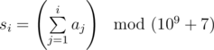

# C. Partial Sums

**time limit per test:** 4 seconds

**memory limit per test:** 256 megabytes

**input:** stdin

**output:** stdout

You've got an array *a*, consisting of *n* integers. The array elements are indexed from 1 to *n*. Let's determine a two step operation like that:

- First we build by the array *a* an array *s* of partial sums, consisting of *n* elements. Element number *i* (1 ≤ *i* ≤ *n*) of array *s* equals



. The operation *x* *mod* *y* means that we take the remainder of the division of number *x* by number *y*.
- Then we write the contents of the array *s* to the array *a*. Element number *i* (1 ≤ *i* ≤ *n*) of the array *s* becomes the *i*-th element of the array *a* (*a*~*i*~ = *s*~*i*~).

You task is to find array *a* after exactly *k* described operations are applied.

#### Input

The first line contains two space-separated integers *n* and *k* (1 ≤ *n* ≤ 2000, 0 ≤ *k* ≤ 10^9^). The next line contains *n* space-separated integers *a*~1~, *a*~2~, ..., *a*~*n*~ — elements of the array *a* (0 ≤ *a*~*i*~ ≤ 10^9^).

#### Output

Print *n* integers  — elements of the array *a* after the operations are applied to it. Print the elements in the order of increasing of their indexes in the array *a*. Separate the printed numbers by spaces.

#### Examples

#### Input
```
3 1
1 2 3
```

#### Output
```
1 3 6
```

#### Input
```
5 0
3 14 15 92 6
```

#### Output
```
3 14 15 92 6
```
