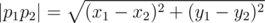

# D. Spider

**time limit per test:** 3 seconds

**memory limit per test:** 256 megabytes

**input:** stdin

**output:** stdout

A plane contains a not necessarily convex polygon without self-intersections, consisting of *n* vertexes, numbered from 1 to *n*. There is a spider sitting on the border of the polygon, the spider can move like that:

- Transfer. The spider moves from the point *p*~1~ with coordinates (*x*~1~, *y*~1~), lying on the polygon border, to the point *p*~2~ with coordinates (*x*~2~, *y*~2~), also lying on the border. The spider can't go beyond the polygon border as it transfers, that is, the spider's path from point *p*~1~ to point *p*~2~ goes along the polygon border. It's up to the spider to choose the direction of walking round the polygon border (clockwise or counterclockwise).
- Descend. The spider moves from point *p*~1~ with coordinates (*x*~1~, *y*~1~) to point *p*~2~ with coordinates (*x*~2~, *y*~2~), at that points *p*~1~ and *p*~2~ must lie on one vertical straight line (*x*~1~ = *x*~2~), point *p*~1~ must be not lower than point *p*~2~ (*y*~1~ ≥ *y*~2~) and segment *p*~1~*p*~2~ mustn't have points, located strictly outside the polygon (specifically, the segment can have common points with the border).

Initially the spider is located at the polygon vertex with number *s*. Find the length of the shortest path to the vertex number *t*, consisting of transfers and descends. The distance is determined by the usual Euclidean metric



.

#### Input

The first line contains integer *n* (3 ≤ *n* ≤ 10^5^) — the number of vertexes of the given polygon. Next *n* lines contain two space-separated integers each — the coordinates of the polygon vertexes. The vertexes are listed in the counter-clockwise order. The coordinates of the polygon vertexes do not exceed 10^4^ in their absolute value.

The last line contains two space-separated integers *s* and *t* (1 ≤ *s*, *t* ≤ *n*) — the start and the end vertexes of the sought shortest way.

Consider the polygon vertexes numbered in the order they are given in the input, that is, the coordinates of the first vertex are located on the second line of the input and the coordinates of the *n*-th vertex are on the (*n* + 1)-th line. It is guaranteed that the given polygon is simple, that is, it contains no self-intersections or self-tangencies.

#### Output

In the output print a single real number — the length of the shortest way from vertex *s* to vertex *t*. The answer is considered correct, if its absolute or relative error does not exceed 10^ - 6^.

#### Examples

#### Input
```
4
0 0
1 0
1 1
0 1
1 4
```

#### Output
```
1.000000000000000000e+000
```

#### Input
```
4
0 0
1 1
0 2
-1 1
3 3
```

#### Output
```
0.000000000000000000e+000
```

#### Input
```
5
0 0
5 0
1 4
0 2
2 1
3 1
```

#### Output
```
5.650281539872884700e+000
```

#### Note

In the first sample the spider transfers along the side that connects vertexes 1 and 4.

In the second sample the spider doesn't have to transfer anywhere, so the distance equals zero.

In the third sample the best strategy for the spider is to transfer from vertex 3 to point (2,3), descend to point (2,1), and then transfer to vertex 1.
