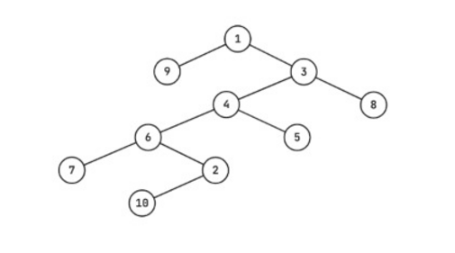

# E. Fair and Square

**time limit per test:** 3 seconds

**memory limit per test:** 256 megabytes

**input:** standard input

**output:** standard output

A tree is an undirected connected graph with no cycles.

You are given a tree having $n$ vertices. Each vertex $i$ has an integer value $a_i$ written on it.

For any two vertices $u$ and $v$ ($u \ne v$), define $p(u, v)$ as the product of the values written on the vertices lying on the unique simple path$^{\text{∗}}$ from $u$ to $v$.

An unordered triplet of three distinct vertices $\{u, v, w\}$ is called good if and only if: $p(u,v)\cdot p(v,w)\cdot p(w,u)$ is a perfect square.

Determine the number of good unordered triplets in the given tree.

$^{\text{∗}}$A simple path from the vertex $u$ to vertex $v$ is a sequence of distinct vertices $u = x_0, x_1, \ldots, x_k = v$ such that there exists an edge between vertices $x_{i-1}$ and $x_i$ for all $1 \le i \le k$.

#### Input

The first line contains an integer $t$ ($1 \le t \le 10^4$) — the number of test cases. The description of each test case follows.

Each test case begins with an integer $n$ ($3 \le n \le 2\cdot 10^5$) — the number of vertices.

The second line contains $n$ integers $a_1,a_2,\dots,a_n$ ($1 \le a_i \le 10^6$) — the integer values written on the vertices.

Each of the next $n-1$ lines contains two integers $u,v$ ($1 \le u,v \le n$), denoting an edge of the tree. It is guaranteed that the edges form a tree.

It is guaranteed that the sum of $n$ over all the test cases does not exceed $2\cdot 10^5$.

#### Output

For each test case output the number of good triplets in the tree.

#### Example

#### Input
```
4
5
1 1 1 1 1
1 2
2 3
2 4
4 5
10
1 2 3 4 5 6 7 8 9 10
1 3
2 6
6 7
5 4
8 3
3 4
4 6
9 1
10 2
6
12 6 3 18 9 2
3 4
4 5
2 6
6 1
4 2
8
3 16 9 1 8 16 4 9
2 1
3 1
4 3
3 5
6 3
4 7
8 1
```

#### Output
```
10
48
0
40
```

#### Note

For the first test case, all the unordered triplets of three distinct vertices are good:

- $\{1, 2, 3\}$
- $\{1, 2, 4\}$
- $\{1, 2, 5\}$
- $\{1, 3, 4\}$
- $\{1, 3, 5\}$
- $\{1, 4, 5\}$
- $\{2, 3, 4\}$
- $\{2, 3, 5\}$
- $\{2, 4, 5\}$
- $\{3, 4, 5\}$
 For the second test case, $\{2, 5, 8\}$ is a good triplet.


