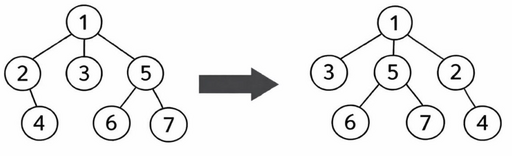

# F. Anya Loves Trees!

**time limit per test:** 2 seconds

**memory limit per test:** 512 megabytes

**input:** standard input

**output:** standard output

Anya considers a rooted tree with the root at vertex $1$. The leaves of the tree contain integers from $1$ to $k$, where $k$ is the number of leaves. Each leaf contains exactly one number. For every vertex, its children are ordered from left to right in increasing order of their indices.

Anya noticed that if we list the leaves from left to right, their values form a sequence. She wants this sequence to become strictly increasing.

To achieve this, Anya can perform the following operation: choose any vertex and cyclically shift its children to the left$^{\text{∗}}$. For example, if a vertex has children in the order $[1, 2, 3]$, after the shift the order becomes $[2, 3, 1]$. This operation can be applied to any vertices any number of times.

A visual example of a cyclic shift of the children of vertex $1$:




 An example of a cyclic shift of children.
Help Yura determine whether Anya can make the sequence of integers in the leaves strictly increasing from left to right using such operations.

$^{\text{∗}}$A cyclic left shift is an operation where all elements are shifted left by $1$, and the first element becomes the last.

#### Input

The first line contains a single integer $t$ ($1 \le t \le 10^4$) — the number of test cases.

The first line of each test case contains a single integer $n$ ($1 \le n \le 2 \cdot 10^5$) — the number of vertices.

The next line contains $n - 1$ integers $p_2, p_3, \dots, p_n$ ($1 \le p_i \le n$), where $p_i$ is the parent of vertex $i$. The children of each vertex are ordered from left to right in increasing order of their indices.

The third line contains $n$ integers $a_1, a_2, \dots, a_n$ ($0 \le a_i \le n$). If vertex $i$ is not a leaf, then $a_i = 0$. If vertex $i$ is a leaf, then $a_i \gt 0$ and represents the number written in that vertex. It is guaranteed that all positive values $a_i$ form a permutation.

It is guaranteed that the sum of $n$ over all test cases does not exceed $2 \cdot 10^5$.

#### Output

For each test case, output 'YES" if it is possible to reorder the integers in the leaves to be strictly increasing, and 'NO" otherwise.

You may output each letter in any case (lowercase or uppercase). For example, the strings 'yEs", 'yes", 'Yes", and 'YES" will be accepted.

#### Example

#### Input
```
4
2
1
0 1
4
1 2 2
0 0 2 1
5
5 5 2 1
0 0 1 2 0
4
1 1 1
0 2 1 3
```

#### Output
```
YES
YES
YES
NO
```
