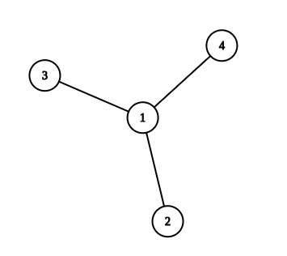

# E. Build a Tree

**time limit per test:** 2 seconds

**memory limit per test:** 256 megabytes

**input:** standard input

**output:** standard output


You are given two integers $n$ and $k$.

Construct a tree$^{\text{∗}}$ with $n$ vertices such that $\sum\limits_{i = 1}^{n} \operatorname{dist}(i, (i \bmod n) + 1) = k$$^{\text{†}}$, or determine that no such tree exists.

$^{\text{∗}}$A tree is a connected graph without cycles.

$^{\text{†}}$$\operatorname{dist}(i, j)$ is the number of edges on the shortest path from vertex $i$ to vertex $j$ in the tree.

#### Input

Each test contains multiple test cases. The first line contains the number of test cases $t$ ($1 \le t \le 10^4$). The description of the test cases follows.

The only line of each test case contains two integers $n$ and $k$ ($2 \le n \le 2 \cdot 10^5$, $0 \le k \le n^2$) — the number of vertices in the tree and the required value of $k$.

It is guaranteed that the sum of $n$ over all test cases does not exceed $2 \cdot 10^5$.

#### Output

For each test case, if there is no solution, output $-1$.

Otherwise, output $n - 1$ lines. Each line should contain two integers $u$ and $v$ ($1 \le u, v \le n$), denoting an edge of the tree. The edges may be output in any order.

If there are multiple suitable trees, output any of them.

#### Example

#### Input
```
5
2 2
4 6
5 10
5 14
100 8347
```

#### Output
```
1 2
1 4
1 3
1 2
3 2
3 4
4 1
5 3
-1
-1
```

#### Note

In the first example, the tree consists of the single edge $(1, 2)$. Therefore, $\operatorname{dist}(1, 2) + \operatorname{dist}(2, 1) = 1 + 1 = 2$.

In the second example, one possible tree is shown below.





For this tree, $\operatorname{dist}(1, 2) + \operatorname{dist}(2, 3) + \operatorname{dist}(3, 4) + \operatorname{dist}(4, 1) = 1 + 2 + 2 + 1 = 6$.

In the fourth example, it can be shown that no suitable tree exists.
