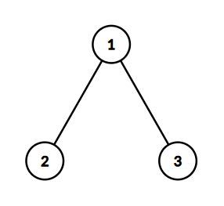
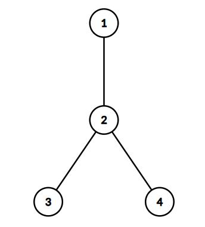

# G. Nightcrawler

**time limit per test:** 2.5 seconds

**memory limit per test:** 256 megabytes

**input:** standard input

**output:** standard output

Yousef has given you a rooted tree$^{\text{∗}}$ with $n$ vertices, where the root is vertex $1$. Each vertex $i$ is assigned an integer $a_i$.

You must partition the set of all $n$ vertices into exactly $k$ disjoint subsets $S_1, S_2, \dots, S_k$ (that is, each vertex must belong to exactly one of the $k$ sets) such that the following condition is satisfied:

- For any subset $S_i$ containing two or more vertices, for every pair of vertices $u, v \in S_i$, one must be the ancestor$^{\text{†}}$ of the other (i.e., they must all lie on the same path extending from the root toward a leaf).

The score of a subset $S_i$ is defined as the maximum value $a_u$ among all vertices $u$ in that subset. The score of the partition is the sum of the scores of the $k$ subsets. In other words, the score of the partition is equal to $\sum\limits_{i=1}^{k} \max\limits_{u \in S_i} a_u$.

For every integer $k$ from $1$ to $n$, calculate the maximum possible score of a partition. If it is impossible to partition the tree into exactly $k$ subsets that satisfy the condition, output $-1$.

$^{\text{∗}}$A tree is a connected graph without cycles. A rooted tree is a tree where one vertex is special and called the root.

$^{\text{†}}$An ancestor of vertex $v$ is any vertex on the simple path from $v$ to the root, including the root, but not including $v$. The root has no ancestors.

#### Input

The first line contains an integer $t$ ($1 \le t \le 10^4$) — the number of test cases.

The first line of each test case contains an integer $n$ ($3 \le n \le 2 \cdot 10^5$) — the number of vertices.

The second line of each test case contains $n$ integers $a_1, a_2, \dots, a_n$ ($1 \le a_i \le 10^9$) — the values of the vertices.

The third line of each test case contains $n-1$ integers $p_2, p_3, \dots, p_n$ ($1 \le p_i \lt i$), where $p_i$ is the parent of the $i$-th vertex.

It is guaranteed that the sum of $n$ over all test cases does not exceed $2 \cdot 10^5$.

#### Output

For each test case, output a single line containing $n$ space-separated integers. The $k$-th integer should represent the maximum possible score for a partition of $k$ subsets. If it is impossible to partition the tree into $k$ subsets, output $-1$ for that value.

#### Example

#### Input
```
7
3
10 20 30
1 1
4
5 10 15 20
1 2 2
4
1 2 3 4
1 1 3
5
1 2 3 4 5
1 2 3 4
9
1 100 1 90 80 1 2 3 4
1 1 2 4 3 3 3 3
6
5 4 10 3 9 1
1 2 1 4 1
4
10 10 20 1
1 2 1
```

#### Output
```
-1 50 60
-1 35 45 50
-1 6 9 10
5 9 12 14 15
-1 -1 -1 -1 110 200 280 281 282
-1 -1 24 28 31 32
-1 30 40 41
```

#### Note

In the first test case:

- For $k = 1$, we would need all the vertices to be in the same set. However, for vertices $2$ and $3$, neither of them is the ancestor of the other. Therefore, there is no valid partition.
- For $k = 2$, we can make $S_1 = \{2\}$, $S_2 = \{1, 3\}$. The score of this partition is $\max\limits_{u \in S_1} a_u + \max\limits_{u \in S_2} a_u = 20 + 30 = 50$. It can be shown that this is the maximum score.
- For $k = 3$, we can make $S_1 = \{1\}$, $S_2 = \{2\}$, $S_3 = \{3\}$. The score of this partition is $10 + 20 + 30 = 60$.




 The given tree in the first test case.
In the second test case:

- For $k = 1$, we would need all the vertices to be in the same set. However, vertices $3$ and $4$ are not on the same root-to-leaf path, so this is impossible.
- For $k = 2$, we can make $S_1 = \{3\}$, $S_2 = \{1,2,4\}$. The score of this partition is $\max\limits_{u \in S_1} a_u + \max\limits_{u \in S_2} a_u = 15 + 20 = 35$. It can be shown that this is the maximum score.
- For $k = 3$, we can make $S_1 = \{3\}$, $S_2 = \{4\}$, $S_3 = \{1,2\}$. The score of this partition is $15 + 20 + 10 = 45$. It can be shown that this is the maximum score.
- For $k = 4$, we can make $S_1 = \{1\}$, $S_2 = \{2\}$, $S_3 = \{3\}$, $S_4 = \{4\}$. The score of this partition is $5 + 10 + 15 + 20 = 50$.




 The given tree in the second test case.
