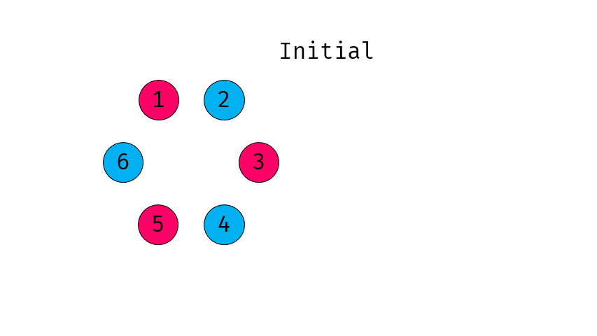

# A. Hot Potatoes at the Fairy Warehouse

**time limit per test:** 2 seconds

**memory limit per test:** 256 megabytes

**input:** standard input

**output:** standard output


On a quiet afternoon at the Fairy Warehouse, Ithea gathers Chtholly, Nephren, and the other leprechauns for one last game before dinner: Hot Potatoes.

There are $2n$ leprechauns sitting in a circle, numbered from $1$ to $2n$ clockwise. They are divided into two teams: leprechauns with odd numbers belong to the Red Team, while those with even numbers belong to the Blue Team.

Initially, some leprechauns hold a potato. The game then lasts for $k$ rounds.

At the beginning of each round, both teams know the current positions of all potatoes. Then, simultaneously, every leprechaun holding a potato does exactly one of the following:

- Keep the potato, or
- Pass the potato to the next leprechaun clockwise, provided that the next leprechaun does not hold a potato at the beginning of the round.

If the next leprechaun holds a potato at the beginning of the round, the current holder must keep their potato. Whether a potato can be passed depends only on the positions of the potatoes at the beginning of the round.

Under these rules, every leprechaun holds at most one potato at any time.

When all $k$ rounds are over, the final bell rings. Every leprechaun still holding a potato is eliminated from the game. The score of each team is defined as the number of eliminated leprechauns on the other team. All members of each team cooperate and share all available information to maximize their team's score.

Find the scores of the Red Team and the Blue Team if both teams play optimally. It can be shown that the scores under optimal play are uniquely determined.

#### Input

Each test contains multiple test cases. The first line contains the number of test cases $t$ ($1 \le t \le 10^4$). The description of the test cases follows.

The first line of each test case contains two integers $n$ and $k$ ($1\le n\le 10^5$, $1\le k\le 10^9$) — half the number of leprechauns and the number of rounds.

The second line contains a binary string $s$ of length $2n$ ($s_i=\texttt{0}$ or $\texttt{1}$) describing the initial state of the game. If $s_i=\texttt{1}$, leprechaun $i$ initially holds a potato; otherwise, they do not.

It is guaranteed that the sum of $n$ over all test cases does not exceed $10^5$.

#### Output

For each test case, print two integers — the scores of the Red Team and the Blue Team, respectively, if they play optimally.

#### Example

#### Input
```
6
2 1
1000
2 1
0011
3 2
101110
5 100000
1111111111
5 100000
0000000000
7 4
10011110101011
```

#### Output
```
1 0
0 2
3 1
5 5
0 0
7 2
```

#### Note

In the first test case, it is optimal for leprechaun $1$ to pass the potato to leprechaun $2$ in the only round. Afterwards, only leprechaun $2$, who belongs to the Blue Team, holds a potato. Therefore, the score of the Red Team is $1$, while the score of the Blue Team is $0$.

In the second test case, it is optimal for leprechaun $4$ to pass their potato to leprechaun $1$ in the only round. Note that leprechaun $3$ cannot pass their potato to leprechaun $4$, because leprechaun $4$ already holds a potato at the beginning of the round.

Here is a demonstration for the third test case:





Note that this is one possible optimal strategy for both teams. Other optimal strategies may exist, but the resulting scores are the same.
