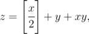

# E. Unsolvable

**time limit per test:** 2 seconds

**memory limit per test:** 256 megabytes

**input:** stdin

**output:** stdout

Consider the following equation:



 where sign [*a*] represents the integer part of number *a*.
Let's find all integer *z* (*z* > 0), for which this equation is unsolvable in positive integers. The phrase "unsolvable in positive integers" means that there are no such positive integers *x* and *y* (*x*, *y* > 0), for which the given above equation holds.

Let's write out all such *z* in the increasing order: *z*~1~, *z*~2~, *z*~3~, and so on (*z*~*i*~ < *z*~*i* + 1~). Your task is: given the number *n*, find the number *z*~*n*~.

#### Input

The first line contains a single integer *n* (1 ≤ *n* ≤ 40).

#### Output

Print a single integer — the number *z*~*n*~ modulo 1000000007 (10^9^ + 7). It is guaranteed that the answer exists.

#### Examples

#### Input
```
1
```

#### Output
```
1
```

#### Input
```
2
```

#### Output
```
3
```

#### Input
```
3
```

#### Output
```
15
```
