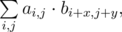

# B. Two Tables

**time limit per test:** 2 seconds

**memory limit per test:** 256 megabytes

**input:** stdin

**output:** stdout

You've got two rectangular tables with sizes *n*~*a*~ × *m*~*a*~ and *n*~*b*~ × *m*~*b*~ cells. The tables consist of zeroes and ones. We will consider the rows and columns of both tables indexed starting from 1. Then we will define the element of the first table, located at the intersection of the *i*-th row and the *j*-th column, as *a*~*i*, *j*~; we will define the element of the second table, located at the intersection of the *i*-th row and the *j*-th column, as *b*~*i*, *j*~.

We will call the pair of integers (*x*, *y*) a shift of the second table relative to the first one. We'll call the overlap factor of the shift (*x*, *y*) value:



where the variables *i*, *j* take only such values, in which the expression *a*~*i*, *j*~·*b*~*i* + *x*, *j* + *y*~ makes sense. More formally, inequalities 1 ≤ *i* ≤ *n*~*a*~, 1 ≤ *j* ≤ *m*~*a*~, 1 ≤ *i* + *x* ≤ *n*~*b*~, 1 ≤ *j* + *y* ≤ *m*~*b*~ must hold. If there are no values of variables *i*, *j*, that satisfy the given inequalities, the value of the sum is considered equal to 0.

Your task is to find the shift with the maximum overlap factor among all possible shifts.

#### Input

The first line contains two space-separated integers *n*~*a*~, *m*~*a*~ (1 ≤ *n*~*a*~, *m*~*a*~ ≤ 50) — the number of rows and columns in the first table. Then *n*~*a*~ lines contain *m*~*a*~ characters each — the elements of the first table. Each character is either a "0", or a "1".

The next line contains two space-separated integers *n*~*b*~, *m*~*b*~ (1 ≤ *n*~*b*~, *m*~*b*~ ≤ 50) — the number of rows and columns in the second table. Then follow the elements of the second table in the format, similar to the first table.

It is guaranteed that the first table has at least one number "1". It is guaranteed that the second table has at least one number "1".

#### Output

Print two space-separated integers *x*, *y* (|*x*|, |*y*| ≤ 10^9^) — a shift with maximum overlap factor. If there are multiple solutions, print any of them.

#### Examples

#### Input
```
3 2
01
10
00
2 3
001
111
```

#### Output
```
0 1
```

#### Input
```
3 3
000
010
000
1 1
1
```

#### Output
```
-1 -1
```
