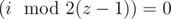
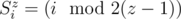
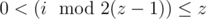
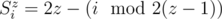
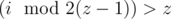
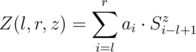

# D. Zigzag

**time limit per test:** 3 seconds

**memory limit per test:** 256 megabytes

**input:** stdin

**output:** stdout

The court wizard Zigzag wants to become a famous mathematician. For that, he needs his own theorem, like the Cauchy theorem, or his sum, like the Minkowski sum. But most of all he wants to have his sequence, like the Fibonacci sequence, and his function, like the Euler's totient function.

The Zigag's sequence with the zigzag factor z is an infinite sequence *S*~*i*~^*z*^ (*i* ≥ 1; *z* ≥ 2), that is determined as follows:

- *S*~*i*~^*z*^ = 2, when



;
-



, when



;
-



, when



.

Operation


 means taking the remainder from dividing number *x* by number *y*. For example, the beginning of sequence *S*~*i*~^3^ (zigzag factor 3) looks as follows: 1, 2, 3, 2, 1, 2, 3, 2, 1.

Let's assume that we are given an array *a*, consisting of *n* integers. Let's define element number *i* (1 ≤ *i* ≤ *n*) of the array as *a*~*i*~. The Zigzag function is function



, where *l*, *r*, *z* satisfy the inequalities 1 ≤ *l* ≤ *r* ≤ *n*, *z* ≥ 2.

To become better acquainted with the Zigzag sequence and the Zigzag function, the wizard offers you to implement the following operations on the given array *a*.

- The assignment operation. The operation parameters are (*p*, *v*). The operation denotes assigning value *v* to the *p*-th array element. After the operation is applied, the value of the array element *a*~*p*~ equals *v*.
- The Zigzag operation. The operation parameters are (*l*, *r*, *z*). The operation denotes calculating the Zigzag function *Z*(*l*, *r*, *z*).

Explore the magical powers of zigzags, implement the described operations.

#### Input

The first line contains integer *n* (1 ≤ *n* ≤ 10^5^) — The number of elements in array *a*. The second line contains *n* space-separated integers: *a*~1~, *a*~2~, ..., *a*~*n*~ (1 ≤ *a*~*i*~ ≤ 10^9^) — the elements of the array.

The third line contains integer *m* (1 ≤ *m* ≤ 10^5^) — the number of operations. Next *m* lines contain the operations' descriptions. An operation's description starts with integer *t*~*i*~ (1 ≤ *t*~*i*~ ≤ 2) — the operation type.

- If *t*~*i*~ = 1 (assignment operation), then on the line follow two space-separated integers: *p*~*i*~, *v*~*i*~ (1 ≤ *p*~*i*~ ≤ *n*; 1 ≤ *v*~*i*~ ≤ 10^9^) — the parameters of the assigning operation.
- If *t*~*i*~ = 2 (Zigzag operation), then on the line follow three space-separated integers: *l*~*i*~, *r*~*i*~, *z*~*i*~ (1 ≤ *l*~*i*~ ≤ *r*~*i*~ ≤ *n*; 2 ≤ *z*~*i*~ ≤ 6) — the parameters of the Zigzag operation.

You should execute the operations in the order, in which they are given in the input.

#### Output

For each Zigzag operation print the calculated value of the Zigzag function on a single line. Print the values for Zigzag functions in the order, in which they are given in the input.

Please, do not use the %lld specifier to read or write 64-bit integers in С++. It is preferred to use cin, cout streams or the %I64d specifier.

#### Examples

#### Input
```
5
2 3 1 5 5
4
2 2 3 2
2 1 5 3
1 3 5
2 1 5 3
```

#### Output
```
5
26
38
```

#### Note

Explanation of the sample test:

- Result of the first operation is *Z*(2, 3, 2) = 3·1 + 1·2 = 5.
- Result of the second operation is *Z*(1, 5, 3) = 2·1 + 3·2 + 1·3 + 5·2 + 5·1 = 26.
- After the third operation array *a* is equal to 2, 3, 5, 5, 5.
- Result of the forth operation is *Z*(1, 5, 3) = 2·1 + 3·2 + 5·3 + 5·2 + 5·1 = 38.
