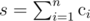

# B. Young Table

**time limit per test:** 2 seconds

**memory limit per test:** 256 megabytes

**input:** stdin

**output:** stdout

You've got table *a*, consisting of *n* rows, numbered from 1 to *n*. The *i*-th line of table *a* contains *c*~*i*~ cells, at that for all *i* (1 < *i* ≤ *n*) holds *c*~*i*~ ≤ *c*~*i* - 1~.

Let's denote *s* as the total number of cells of table *a*, that is,



. We know that each cell of the table contains a single integer from 1 to *s*, at that all written integers are distinct.

Let's assume that the cells of the *i*-th row of table *a* are numbered from 1 to *c*~*i*~, then let's denote the number written in the *j*-th cell of the *i*-th row as *a*~*i*, *j*~. Your task is to perform several swap operations to rearrange the numbers in the table so as to fulfill the following conditions:

- for all *i*, *j* (1 < *i* ≤ *n*; 1 ≤ *j* ≤ *c*~*i*~) holds *a*~*i*, *j*~ > *a*~*i* - 1, *j*~;
- for all *i*, *j* (1 ≤ *i* ≤ *n*; 1 < *j* ≤ *c*~*i*~) holds *a*~*i*, *j*~ > *a*~*i*, *j* - 1~.

In one swap operation you are allowed to choose two different cells of the table and swap the recorded there numbers, that is the number that was recorded in the first of the selected cells before the swap, is written in the second cell after it. Similarly, the number that was recorded in the second of the selected cells, is written in the first cell after the swap.

Rearrange the numbers in the required manner. Note that you are allowed to perform any number of operations, but not more than *s*. You do not have to minimize the number of operations.

#### Input

The first line contains a single integer *n* (1 ≤ *n* ≤ 50) that shows the number of rows in the table. The second line contains *n* space-separated integers *c*~*i*~ (1 ≤ *c*~*i*~ ≤ 50; *c*~*i*~ ≤ *c*~*i* - 1~) — the numbers of cells on the corresponding rows.

Next *n* lines contain table *а*. The *i*-th of them contains *c*~*i*~ space-separated integers: the *j*-th integer in this line represents *a*~*i*, *j*~.

It is guaranteed that all the given numbers *a*~*i*, *j*~ are positive and do not exceed *s*. It is guaranteed that all *a*~*i*, *j*~ are distinct.

#### Output

In the first line print a single integer *m* (0 ≤ *m* ≤ *s*), representing the number of performed swaps.

In the next *m* lines print the description of these swap operations. In the *i*-th line print four space-separated integers *x*~*i*~, *y*~*i*~, *p*~*i*~, *q*~*i*~ (1 ≤ *x*~*i*~, *p*~*i*~ ≤ *n*; 1 ≤ *y*~*i*~ ≤ *c*~*x*~*i*~~; 1 ≤ *q*~*i*~ ≤ *c*~*p*~*i*~~). The printed numbers denote swapping the contents of cells *a*~*x*~*i*~, *y*~*i*~~ and *a*~*p*~*i*~, *q*~*i*~~. Note that a swap operation can change the contents of distinct table cells. Print the swaps in the order, in which they should be executed.

#### Examples

#### Input
```
3
3 2 1
4 3 5
6 1
2
```

#### Output
```
2
1 1 2 2
2 1 3 1
```

#### Input
```
1
4
4 3 2 1
```

#### Output
```
2
1 1 1 4
1 2 1 3
```
