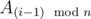

# C. Sequence of points

**time limit per test:** 2 seconds

**memory limit per test:** 256 megabytes

**input:** stdin

**output:** stdout

You are given the following points with integer coordinates on the plane: *M*~0~, *A*~0~, *A*~1~, ..., *A*~*n* - 1~, where *n* is odd number. Now we define the following infinite sequence of points *M*~*i*~: *M*~*i*~ is symmetric to *M*~*i* - 1~ according



 (for every natural number *i*). Here point *B* is symmetric to *A* according *M*, if *M* is the center of the line segment *AB*. Given index *j* find the point *M*~*j*~.

#### Input

On the first line you will be given an integer *n* (1 ≤ *n* ≤ 10^5^), which will be odd, and *j* (1 ≤ *j* ≤ 10^18^), where *j* is the index of the desired point. The next line contains two space separated integers, the coordinates of *M*~0~. After that *n* lines follow, where the *i*-th line contain the space separated integer coordinates of the point *A*~*i* - 1~. The absolute values of all input coordinates will not be greater then 1000.

#### Output

On a single line output the coordinates of *M*~*j*~, space separated.

#### Examples

#### Input
```
3 4
0 0
1 1
2 3
-5 3
```

#### Output
```
14 0
```

#### Input
```
3 1
5 5
1000 1000
-1000 1000
3 100
```

#### Output
```
1995 1995
```
