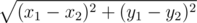

# D. Building Bridge

**time limit per test:** 1 second

**memory limit per test:** 256 megabytes

**input:** stdin

**output:** stdout

Two villages are separated by a river that flows from the north to the south. The villagers want to build a bridge across the river to make it easier to move across the villages.

The river banks can be assumed to be vertical straight lines *x* = *a* and *x* = *b* (0 < *a* < *b*).

The west village lies in a steppe at point *O* = (0, 0). There are *n* pathways leading from the village to the river, they end at points *A*~*i*~ = (*a*, *y*~*i*~). The villagers there are plain and simple, so their pathways are straight segments as well.

The east village has reserved and cunning people. Their village is in the forest on the east bank of the river, but its exact position is not clear. There are *m* twisted paths leading from this village to the river and ending at points *B*~*i*~ = (*b*, *y*'~*i*~). The lengths of all these paths are known, the length of the path that leads from the eastern village to point *B*~*i*~, equals *l*~*i*~.

The villagers want to choose exactly one point on the left bank of river *A*~*i*~, exactly one point on the right bank *B*~*j*~ and connect them by a straight-line bridge so as to make the total distance between the villages (the sum of |*OA*~*i*~| + |*A*~*i*~*B*~*j*~| + *l*~*j*~, where |*XY*| is the Euclidean distance between points *X* and *Y*) were minimum. The Euclidean distance between points (*x*~1~, *y*~1~) and (*x*~2~, *y*~2~) equals



.

Help them and find the required pair of points.

#### Input

The first line contains integers *n*, *m*, *a*, *b* (1 ≤ *n*, *m* ≤ 10^5^, 0 < *a* < *b* < 10^6^).

The second line contains *n* integers in the ascending order: the *i*-th integer determines the coordinate of point *A*~*i*~ and equals *y*~*i*~ (|*y*~*i*~| ≤ 10^6^).

The third line contains *m* integers in the ascending order: the *i*-th integer determines the coordinate of point *B*~*i*~ and equals *y*'~*i*~ (|*y*'~*i*~| ≤ 10^6^).

The fourth line contains *m* more integers: the *i*-th of them determines the length of the path that connects the eastern village and point *B*~*i*~, and equals *l*~*i*~ (1 ≤ *l*~*i*~ ≤ 10^6^).

It is guaranteed, that there is such a point *C* with abscissa at least *b*, that |*B*~*i*~*C*| ≤ *l*~*i*~ for all *i* (1 ≤ *i* ≤ *m*). It is guaranteed that no two points *A*~*i*~ coincide. It is guaranteed that no two points *B*~*i*~ coincide.

#### Output

Print two integers — the numbers of points on the left (west) and right (east) banks, respectively, between which you need to build a bridge. You can assume that the points on the west bank are numbered from 1 to *n*, in the order in which they are given in the input. Similarly, the points on the east bank are numbered from 1 to *m* in the order in which they are given in the input.

If there are multiple solutions, print any of them. The solution will be accepted if the final length of the path will differ from the answer of the jury by no more than 10^ - 6^ in absolute or relative value.

#### Examples

#### Input
```
3 2 3 5
-2 -1 4
-1 2
7 3
```

#### Output
```
2 2
```
