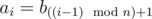
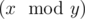

# D. Maxim and Increasing Subsequence

**time limit per test:** 6 seconds

**memory limit per test:** 256 megabytes

**input:** stdin

**output:** stdout

Maxim loves sequences, especially those that strictly increase. He is wondering, what is the length of the longest increasing subsequence of the given sequence *a*?

Sequence *a* is given as follows:

- the length of the sequence equals *n* × *t*;
-



 (1 ≤ *i* ≤ *n* × *t*), where operation



 means taking the remainder after dividing number *x* by number *y*.

Sequence *s*~1~,  *s*~2~,  ...,  *s*~*r*~ of length *r* is a subsequence of sequence *a*~1~,  *a*~2~,  ...,  *a*~*n*~, if there is such increasing sequence of indexes *i*~1~, *i*~2~, ..., *i*~*r*~ (1  ≤  *i*~1~  <  *i*~2~  < ...   <  *i*~*r*~  ≤  *n*), that *a*~*i*~*j*~~  =  *s*~*j*~. In other words, the subsequence can be obtained from the sequence by crossing out some elements.

Sequence *s*~1~,  *s*~2~,  ...,  *s*~*r*~ is increasing, if the following inequality holds: *s*~1~ < *s*~2~ <  ... <  *s*~*r*~.

Maxim have *k* variants of the sequence *a*. Help Maxim to determine for each sequence the length of the longest increasing subsequence.

#### Input

The first line contains four integers *k*, *n*, *maxb* and *t* (1 ≤ *k* ≤ 10; 1 ≤ *n*, *maxb* ≤ 10^5^; 1 ≤ *t* ≤ 10^9^; *n* × *maxb* ≤ 2·10^7^). Each of the next *k* lines contain *n* integers *b*~1~, *b*~2~, ..., *b*~*n*~ (1 ≤ *b*~*i*~ ≤ *maxb*).

Note that for each variant of the sequence *a* the values *n*, *maxb* and *t* coincide, the only arrays *b*s differ.

The numbers in the lines are separated by single spaces.

#### Output

Print *k* integers — the answers for the variants of the sequence *a*. Print the answers in the order the variants follow in the input.

#### Examples

#### Input
```
3 3 5 2
3 2 1
1 2 3
2 3 1
```

#### Output
```
2
3
3
```
