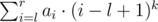
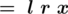
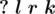

# E. More Queries to Array...

**time limit per test:** 5 seconds

**memory limit per test:** 256 megabytes

**input:** stdin

**output:** stdout

You've got an array, consisting of *n* integers: *a*~1~, *a*~2~, ..., *a*~*n*~. Your task is to quickly run the queries of two types:
- Assign value *x* to all elements from *l* to *r* inclusive. After such query the values of the elements of array *a*~*l*~, *a*~*l* + 1~, ..., *a*~*r*~ become equal to *x*.
- Calculate and print sum



, where *k* doesn't exceed 5. As the value of the sum can be rather large, you should print it modulo 1000000007 (10^9^ + 7).

#### Input

The first line contains two integers *n* and *m* (1 ≤ *n*, *m* ≤ 10^5^), showing, how many numbers are in the array and the number of queries, correspondingly. The second line contains *n* integers: *a*~1~, *a*~2~, ..., *a*~*n*~ (0 ≤ *a*~*i*~ ≤ 10^9^) — the initial values of the array elements.

Then *m* queries follow, one per line:
- The assign query has the following format: "



", (1 ≤ *l* ≤ *r* ≤ *n*; 0 ≤ *x* ≤ 10^9^).
- The query to calculate the sum has the following format: "



", (1 ≤ *l* ≤ *r* ≤ *n*; 0 ≤ *k* ≤ 5).

All numbers in the input are integers.

#### Output

For each query to calculate the sum print an integer — the required sum modulo 1000000007 (10^9^ + 7).

#### Examples

#### Input
```
4 5
5 10 2 1
? 1 2 1
= 2 2 0
? 2 4 3
= 1 4 1
? 1 4 5
```

#### Output
```
25
43
1300
```

#### Input
```
3 1
1000000000 1000000000 1000000000
? 1 3 0
```

#### Output
```
999999986
```
