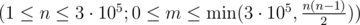

# E. Dima and Horses

**time limit per test:** 2 seconds

**memory limit per test:** 256 megabytes

**input:** stdin

**output:** stdout

Dima came to the horse land. There are *n* horses living in the land. Each horse in the horse land has several enemies (enmity is a symmetric relationship). The horse land isn't very hostile, so the number of enemies of each horse is at most 3.

Right now the horse land is going through an election campaign. So the horses trusted Dima to split them into two parts. At that the horses want the following condition to hold: a horse shouldn't have more than one enemy in its party.

Help Dima split the horses into parties. Note that one of the parties can turn out to be empty.

#### Input

The first line contains two integers *n*, *m*



 — the number of horses in the horse land and the number of enemy pairs.

Next *m* lines define the enemy pairs. The *i*-th line contains integers *a*~*i*~, *b*~*i*~ (1 ≤ *a*~*i*~, *b*~*i*~ ≤ *n*; *a*~*i*~ ≠ *b*~*i*~), which mean that horse *a*~*i*~ is the enemy of horse *b*~*i*~.

Consider the horses indexed in some way from 1 to *n*. It is guaranteed that each horse has at most three enemies. No pair of enemies occurs more than once in the input.

#### Output

Print a line, consisting of *n* characters: the *i*-th character of the line must equal "0", if the horse number *i* needs to go to the first party, otherwise this character should equal "1".

If there isn't a way to divide the horses as required, print -1.

#### Examples

#### Input
```
3 3
1 2
3 2
3 1
```

#### Output
```
100
```

#### Input
```
2 1
2 1
```

#### Output
```
00
```

#### Input
```
10 6
1 2
1 3
1 4
2 3
2 4
3 4
```

#### Output
```
0110000000
```
