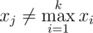

# B. Maximum Xor Secondary

**time limit per test:** 1 second

**memory limit per test:** 256 megabytes

**input:** stdin

**output:** stdout

Bike loves looking for the second maximum element in the sequence. The second maximum element in the sequence of distinct numbers *x*~1~, *x*~2~, ..., *x*~*k*~ (*k* > 1) is such maximum element *x*~*j*~, that the following inequality holds:



.

The lucky number of the sequence of distinct positive integers *x*~1~, *x*~2~, ..., *x*~*k*~ (*k* > 1) is the number that is equal to the bitwise excluding OR of the maximum element of the sequence and the second maximum element of the sequence.

You've got a sequence of distinct positive integers *s*~1~, *s*~2~, ..., *s*~*n*~ (*n* > 1). Let's denote sequence *s*~*l*~, *s*~*l* + 1~, ..., *s*~*r*~ as *s*[*l*..*r*] (1 ≤ *l* < *r* ≤ *n*). Your task is to find the maximum number among all lucky numbers of sequences *s*[*l*..*r*].

Note that as all numbers in sequence *s* are distinct, all the given definitions make sence.

#### Input

The first line contains integer *n* (1 < *n* ≤ 10^5^). The second line contains *n* distinct integers *s*~1~, *s*~2~, ..., *s*~*n*~ (1 ≤ *s*~*i*~ ≤ 10^9^).

#### Output

Print a single integer — the maximum lucky number among all lucky numbers of sequences *s*[*l*..*r*].

#### Examples

#### Input
```
5
5 2 1 4 3
```

#### Output
```
7
```

#### Input
```
5
9 8 3 5 7
```

#### Output
```
15
```

#### Note

For the first sample you can choose *s*[4..5] = {4, 3} and its lucky number is (4 *xor* 3) = 7. You can also choose *s*[1..2].

For the second sample you must choose *s*[2..5] = {8, 3, 5, 7}.
