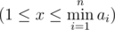

# D. Yet Another Number Game

**time limit per test:** 2 seconds

**memory limit per test:** 256 megabytes

**input:** stdin

**output:** stdout

Since most contestants do not read this part, I have to repeat that Bitlandians are quite weird. They have their own jobs, their own working method, their own lives, their own sausages and their own games!

Since you are so curious about Bitland, I'll give you the chance of peeking at one of these games.

BitLGM and BitAryo are playing yet another of their crazy-looking genius-needed Bitlandish games. They've got a sequence of *n* non-negative integers *a*~1~, *a*~2~, ..., *a*~*n*~. The players make moves in turns. BitLGM moves first. Each player can and must do one of the two following actions in his turn:

- Take one of the integers (we'll denote it as *a*~*i*~). Choose integer *x* (1 ≤ *x* ≤ *a*~*i*~). And then decrease *a*~*i*~ by *x*, that is, apply assignment: *a*~*i*~ = *a*~*i*~ - *x*.
- Choose integer *x*



. And then decrease all *a*~*i*~ by *x*, that is, apply assignment: *a*~*i*~ = *a*~*i*~ - *x*, for all *i*.

The player who cannot make a move loses.

You're given the initial sequence *a*~1~, *a*~2~, ..., *a*~*n*~. Determine who wins, if both players plays optimally well and if BitLGM and BitAryo start playing the described game in this sequence.

#### Input

The first line contains an integer *n* (1 ≤ *n* ≤ 3).

The next line contains *n* integers *a*~1~, *a*~2~, ..., *a*~*n*~ (0 ≤ *a*~*i*~ < 300).

#### Output

Write the name of the winner (provided that both players play optimally well). Either "BitLGM" or "BitAryo" (without the quotes).

#### Examples

#### Input
```
2
1 1
```

#### Output
```
BitLGM
```

#### Input
```
2
1 2
```

#### Output
```
BitAryo
```

#### Input
```
3
1 2 1
```

#### Output
```
BitLGM
```
