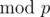
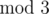
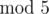

# A. Cows and Primitive Roots

**time limit per test:** 2 seconds

**memory limit per test:** 256 megabytes

**input:** stdin

**output:** stdout

The cows have just learned what a primitive root is! Given a prime *p*, a primitive root



 is an integer *x* (1 ≤ *x* < *p*) such that none of integers *x* - 1, *x*^2^ - 1, ..., *x*^*p* - 2^ - 1 are divisible by *p*, but *x*^*p* - 1^ - 1 is.

Unfortunately, computing primitive roots can be time consuming, so the cows need your help. Given a prime *p*, help the cows find the number of primitive roots


.

#### Input

The input contains a single line containing an integer *p* (2 ≤ *p* < 2000). It is guaranteed that *p* is a prime.

#### Output

Output on a single line the number of primitive roots


.

#### Examples

#### Input
```
3
```

#### Output
```
1
```

#### Input
```
5
```

#### Output
```
2
```

#### Note

The only primitive root



 is 2.

The primitive roots



 are 2 and 3.
