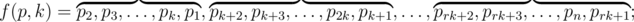

# B. Shifting

**time limit per test:** 2 seconds

**memory limit per test:** 256 megabytes

**input:** stdin

**output:** stdout

John Doe has found the beautiful permutation formula.

Let's take permutation *p* = *p*~1~, *p*~2~, ..., *p*~*n*~. Let's define transformation *f* of this permutation:



where *k* (*k* > 1) is an integer, the transformation parameter, *r* is such maximum integer that *rk* ≤ *n*. If *rk* = *n*, then elements *p*~*rk* + 1~, *p*~*rk* + 2~ and so on are omitted. In other words, the described transformation of permutation *p* cyclically shifts to the left each consecutive block of length *k* and the last block with the length equal to the remainder after dividing *n* by *k*.

John Doe thinks that permutation *f*(*f*( ... *f*(*p* = [1, 2, ..., *n*], 2) ... , *n* - 1), *n*) is beautiful. Unfortunately, he cannot quickly find the beautiful permutation he's interested in. That's why he asked you to help him.

Your task is to find a beautiful permutation for the given *n*. For clarifications, see the notes to the third sample.

#### Input

A single line contains integer *n* (2 ≤ *n* ≤ 10^6^).

#### Output

Print *n* distinct space-separated integers from 1 to *n* — a beautiful permutation of size *n*.

#### Examples

#### Input
```
2
```

#### Output
```
2 1 
```

#### Input
```
3
```

#### Output
```
1 3 2 
```

#### Input
```
4
```

#### Output
```
4 2 3 1 
```

#### Note

A note to the third test sample:

- *f*([1, 2, 3, 4], 2) = [2, 1, 4, 3]
- *f*([2, 1, 4, 3], 3) = [1, 4, 2, 3]
- *f*([1, 4, 2, 3], 4) = [4, 2, 3, 1]
