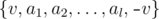

# C. Main Sequence

**time limit per test:** 2 seconds

**memory limit per test:** 256 megabytes

**input:** stdin

**output:** stdout

As you know, Vova has recently become a new shaman in the city of Ultima Thule. So, he has received the shaman knowledge about the correct bracket sequences. The shamans of Ultima Thule have been using lots of different types of brackets since prehistoric times. A bracket type is a positive integer. The shamans define a correct bracket sequence as follows:

- An empty sequence is a correct bracket sequence.
- If {*a*~1~, *a*~2~, ..., *a*~*l*~} and {*b*~1~, *b*~2~, ..., *b*~*k*~} are correct bracket sequences, then sequence {*a*~1~, *a*~2~, ..., *a*~*l*~, *b*~1~, *b*~2~, ..., *b*~*k*~} (their concatenation) also is a correct bracket sequence.
- If {*a*~1~, *a*~2~, ..., *a*~*l*~} — is a correct bracket sequence, then sequence



 also is a correct bracket sequence, where *v* (*v* > 0) is an integer.

For example, sequences {1, 1,  - 1, 2,  - 2,  - 1} and {3,  - 3} are correct bracket sequences, and {2,  - 3} is not.

Moreover, after Vova became a shaman, he learned the most important correct bracket sequence {*x*~1~, *x*~2~, ..., *x*~*n*~}, consisting of *n* integers. As sequence *x* is the most important, Vova decided to encrypt it just in case.

Encrypting consists of two sequences. The first sequence {*p*~1~, *p*~2~, ..., *p*~*n*~} contains types of brackets, that is, *p*~*i*~ = |*x*~*i*~| (1 ≤ *i* ≤ *n*). The second sequence {*q*~1~, *q*~2~, ..., *q*~*t*~} contains *t* integers — some positions (possibly, not all of them), which had negative numbers in sequence {*x*~1~, *x*~2~, ..., *x*~*n*~}.

Unfortunately, Vova forgot the main sequence. But he was lucky enough to keep the encryption: sequences {*p*~1~, *p*~2~, ..., *p*~*n*~} and {*q*~1~, *q*~2~, ..., *q*~*t*~}. Help Vova restore sequence *x* by the encryption. If there are multiple sequences that correspond to the encryption, restore any of them. If there are no such sequences, you should tell so.

#### Input

The first line of the input contains integer *n* (1 ≤ *n* ≤ 10^6^). The second line contains *n* integers: *p*~1~, *p*~2~, ..., *p*~*n*~ (1 ≤ *p*~*i*~ ≤ 10^9^).

The third line contains integer *t* (0 ≤ *t* ≤ *n*), followed by *t* distinct integers *q*~1~, *q*~2~, ..., *q*~*t*~ (1 ≤ *q*~*i*~ ≤ *n*).

The numbers in each line are separated by spaces.

#### Output

Print a single string "NO" (without the quotes) if Vova is mistaken and a suitable sequence {*x*~1~, *x*~2~, ..., *x*~*n*~} doesn't exist.

Otherwise, in the first line print "YES" (without the quotes) and in the second line print *n* integers *x*~1~, *x*~2~, ..., *x*~*n*~ (|*x*~*i*~| = *p*~*i*~; *x*~*q*~*j*~~ < 0). If there are multiple sequences that correspond to the encrypting, you are allowed to print any of them.

#### Examples

#### Input
```
2
1 1
0
```

#### Output
```
YES
1 -1
```

#### Input
```
4
1 1 1 1
1 3
```

#### Output
```
YES
1 1 -1 -1
```

#### Input
```
3
1 1 1
0
```

#### Output
```
NO
```

#### Input
```
4
1 2 2 1
2 3 4
```

#### Output
```
YES
1 2 -2 -1
```
