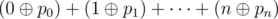

# C. Polo the Penguin and XOR operation

**time limit per test:** 2 seconds

**memory limit per test:** 256 megabytes

**input:** stdin

**output:** stdout

Little penguin Polo likes permutations. But most of all he likes permutations of integers from 0 to *n*, inclusive.

For permutation *p* = *p*~0~, *p*~1~, ..., *p*~*n*~, Polo has defined its beauty — number



.

Expression


 means applying the operation of bitwise excluding "OR" to numbers *x* and *y*. This operation exists in all modern programming languages, for example, in language C++ and Java it is represented as "^" and in Pascal — as "xor".

Help him find among all permutations of integers from 0 to *n* the permutation with the maximum beauty.

#### Input

The single line contains a positive integer *n* (1 ≤ *n* ≤ 10^6^).

#### Output

In the first line print integer *m* the maximum possible beauty. In the second line print any permutation of integers from 0 to *n* with the beauty equal to *m*.

If there are several suitable permutations, you are allowed to print any of them.

#### Examples

#### Input
```
4
```

#### Output
```
20
0 2 1 4 3
```
