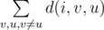

# B. Greg and Graph

**time limit per test:** 3 seconds

**memory limit per test:** 256 megabytes

**input:** stdin

**output:** stdout

Greg has a weighed directed graph, consisting of *n* vertices. In this graph any pair of distinct vertices has an edge between them in both directions. Greg loves playing with the graph and now he has invented a new game:

- The game consists of *n* steps.
- On the *i*-th step Greg removes vertex number *x*~*i*~ from the graph. As Greg removes a vertex, he also removes all the edges that go in and out of this vertex.
- Before executing each step, Greg wants to know the sum of lengths of the shortest paths between all pairs of the remaining vertices. The shortest path can go through any remaining vertex. In other words, if we assume that *d*(*i*, *v*, *u*) is the shortest path between vertices *v* and *u* in the graph that formed before deleting vertex *x*~*i*~, then Greg wants to know the value of the following sum:



.

Help Greg, print the value of the required sum before each step.

#### Input

The first line contains integer *n* (1 ≤ *n* ≤ 500) — the number of vertices in the graph.

Next *n* lines contain *n* integers each — the graph adjacency matrix: the *j*-th number in the *i*-th line *a*~*ij*~ (1 ≤ *a*~*ij*~ ≤ 10^5^, *a*~*ii*~ = 0) represents the weight of the edge that goes from vertex *i* to vertex *j*.

The next line contains *n* distinct integers: *x*~1~, *x*~2~, ..., *x*~*n*~ (1 ≤ *x*~*i*~ ≤ *n*) — the vertices that Greg deletes.

#### Output

Print *n* integers — the *i*-th number equals the required sum before the *i*-th step.

Please, do not use the %lld specifier to read or write 64-bit integers in C++. It is preferred to use the cin, cout streams of the %I64d specifier.

#### Examples

#### Input
```
1
0
1
```

#### Output
```
0 
```

#### Input
```
2
0 5
4 0
1 2
```

#### Output
```
9 0 
```

#### Input
```
4
0 3 1 1
6 0 400 1
2 4 0 1
1 1 1 0
4 1 2 3
```

#### Output
```
17 23 404 0 
```
